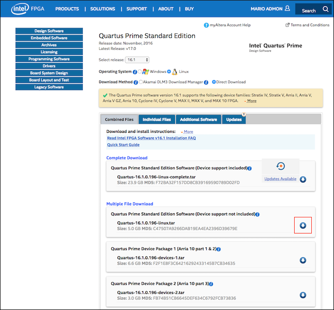
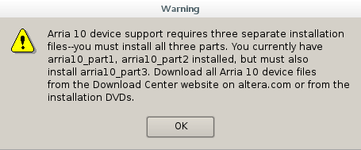
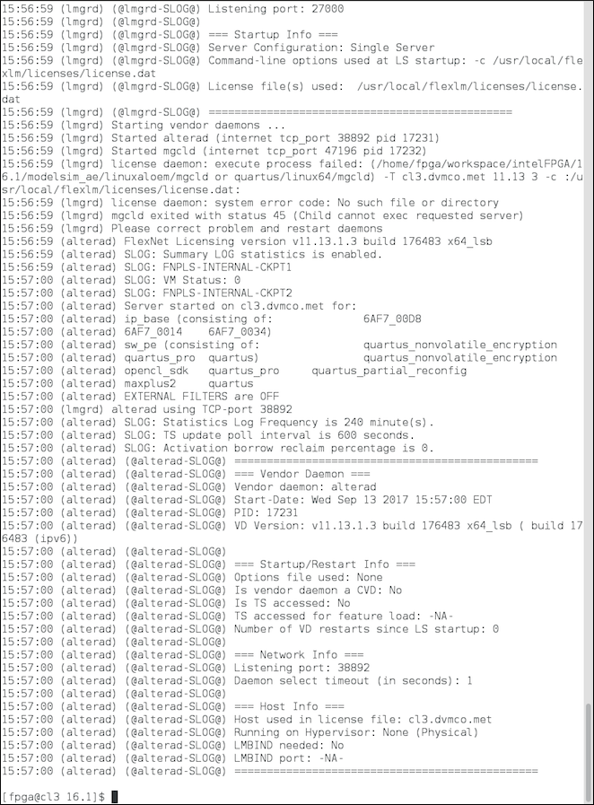

## Preface
So, you want to build your very own hardware (HW) accelerator, or more precisely, HW-accelerated system. Perhaps the desire stems from bottlenecks in software you routinely use, and the frequent coffee breaks are beginning to attract dubious looks from your coworkers. Another possibility is that today, your curiosity has exceeded a certain threshold, and satisfaction only comes in the form of a deep intuition for how software is executed by the underlying hardware in a given system. My last conjecture is that you finally got your hands on an FPGA-wielding embedded system and wish to learn more about which system-level optimization knobs are at your disposal. Regardless of the reason, you're here, and I hope this tutorial fulfills your needs as either a starting point for further extension of this work, a template for your own hardware accelerator project, or even as fundamental training. For me, I'm just happy knowing that 15 months of work has helped at least one other individiual.

In this tutorial, my goal is to cover the development of a complete system: from designing a hardware accelerator at the <a href="https://en.wikipedia.org/wiki/Register-transfer_level">RTL level</a> (implemented and running in an <a href="https://en.wikipedia.org/wiki/Field-programmable_gate_array">FPGA</a>) to system integration (with an ARM CPU, system memory, etc.) to writing a device driver (which provides a kernel-level interface to the newly developed hardware) and ultimately, to modifications necessary in the <a href="https://en.wikipedia.org/wiki/User_space">user space</a> application. While the knowledge gained and experience acquired will be extremely rewarding, undertaking a project of this size requires commitment, perseverance, and the ability to debug without the assistance of <a href="https://stackoverflow.com/tour">Stack Overflow</a> or similar forums. I emphasize the last requirement (and it's a good skill to have in general) for two reasons:
1. *Development at this level is not heavily documented on public forums.* A Google search of a specific error message might yield zero results. Often your only source of information will come from sifting through technical reference manuals, <a href="https://www.altera.com/content/dam/altera-www/global/en_US/pdfs/literature/hb/arria-10/a10_5v4.pdf">like this one</a>. Perhaps Firework will help spark a new wave of interest in open source hardware accelerator/system design by making this work seem less daunting. The best resource to my knowledge for community support can be found at <a href="https://rocketboards.org/">RocketBoards.org</a>, although this may only be useful for <a href="https://rocketboards.org/foswiki/Documentation/Board">a certain set of development boards</a>.
2. *It shows you really understand how things work.* This is especially important when designing hardware and working with embedded systems where bugs could not only arise from user space applicaitons, but also from incompatible system libraries, a device driver, limited system resources, misinterpreting the timing requirements of handshake signals in a bus protocol, errors in your RTL code, or (my personal favorite) from differences between expected and actual behavior of hardware blocks.

Finally, I'd like to note that I'm not claiming to be an expert hardware accelerator or system designer *nor that my design is optimal*; the scope of this project alone is enough to lead to several outcomes (and getting the thing to work was a victory as far as I'm concerned). That's the beauty of open source; several minds are greater than one, and I hope that collaboration and the collective knowledge will lead to interesting new ideas and better design. I welcome any and all feedback and recommendations for improvement!

## Introduction
Firework is an *open source HW-accelerated system design* built for offloading <a href="https://developers.google.com/protocol-buffers/">Protocol Buffer</a> serialization code from the system's CPU. (That was a loaded sentence, I know. If I did my job correctly, by the end of this tutorial it'll make much more sense.) Generally speaking, Firework demonstrates the process of identifying components of some software as candidates for HW acceleration, designing HW to efficiently perform (and replace) that computation, and building a compute system that deviates from the traditional paradigm of executing instructions sequentially on a CPU. Before I continue, its necessary to give the term *system* a precise defintion. In the context of HW acceleration, I define a system as the combination of hardware and software that together perform a specific function. Therefore, the goal of this and any other HW accelerator project is to improve a system's performance by co-optimizing the HW and SW that comprise the system. It's also worth nothing that the HW community distinguishes between *HW acceleration* and *offloading*, although the precise difference is a bit ambiguous. I classify Firework as an attempt to perform the latter since in my design, I move the computation of Protocol Buffer serialization from the system's CPU to a custom processor implemented in the FPGA fabric.

One of the goals of Firework was to target not just any software, but an application running in a large-scale, production datacenter. That way, the developed HW-accelerated system could theoretically replace a generic server(s) supporting that application. The first step naturally was to identify such an application. Fortunately, I came across the paper <a href="https://static.googleusercontent.com/media/research.google.com/en//pubs/archive/44271.pdf">Profiling a warehouse-scale computer</a> whose authors essentially did the search for me - they performed a three-year study on the workloads running across Google's datacenters and were able to identify common building blocks (i.e., low-level software) which they've coined the *datacenter tax*. This datacenter tax "can comprise nearly 30% of cycles across jobs running in the fleet, which makes its constituents prime candidates for hardware specialization in future server systems-on-chips". Perfect! The following figure pulled from the paper shows these constituents and their individual contributions to CPU cycles consumed:


This is what led to my choice of Protocol Buffers ('protobuf' in the figure) as the candidate software for HW acceleration. This software, which accounts for ~3-4% of all CPU cycles consumed across its datacenters, is Google's "language-neutral, platform-neutral extensible mechanism for serializing structured data". In other words, the Protocol Buffer software (compiler + runtime library) is used to <a href="https://en.wikipedia.org/wiki/Serialization">serialize</a> structured data (e.g., a C++ object) into a stream of bytes that is subsequently stored or sent (via <a href="https://en.wikipedia.org/wiki/Remote_procedure_call">RPC</a>) to a receiving service that's able to deserialize the stream of bytes into the original C++ object. I leave it as an exercise for the reader to determine the significance of 3-4% freed CPU at Google's scale in terms of the ability to support additional services in the modern virtualized datacenter. I recommend reading *Profiling a warehouse-scale computer* for more context, going through the <a href="https://developers.google.com/protocol-buffers/docs/cpptutorial">Protocol Buffers C++ tutorial</a>, and understanding <a href="https://developers.google.com/protocol-buffers/docs/encoding">how Protocol Buffers are encoded</a> before continuing on to the [Prerequisites](README.md#prerequisites) section.

To implement Firework (i.e., the HW-accelerated system), I used Altera's (<a href="https://newsroom.intel.com/news-releases/intel-completes-acquisition-of-altera/">now Intel's</a>) <a href="https://www.altera.com/products/boards_and_kits/dev-kits/altera/arria-10-soc-development-kit.html">Arria 10 SoC Development Kit</a>. I discuss the reasoning behind choosing this board later in the tutorial in section [Choosing a development board](README.md#1-choosing-a-development-board).

Firework consists of six main components that, together, implement a HW-accelerated system and provide a means of measuring its performance. These components are listed below.

#### Firework's six main components
- [protobuf-serializer](protobuf-serializer/): the RTL design of a *4-stage pipelined, parallel processor* that performs Protocol Buffer serialization, written in Verilog, and packaged as a Quartus Prime project. The nomenclature stems from four pipeline stages in the design, two parallel datapaths for processing incoming varint and raw data, and a controller that consists of seven independent <a href="https://en.wikipedia.org/wiki/Finite-state_machine">finite-state machines</a> (FSMs). Provided also are <a href="http://www.asic-world.com/verilog/art_testbench_writing1.html">testbenches</a> for each of the FSMs as well as the processor as a whole.
- [a10-soc-devkit-ghrd](a10-soc-devkit-ghrd): the Arria 10 SoC <a href="https://rocketboards.org/foswiki/Documentation/A10GSRD151GHRDOverview">Golden Hardware Reference Design (GHRD)</a> modified with the protobuf-serializer processor added as a memory-mapped FPGA peripheral. This too is packaged as a Quartus Prime project (the main SoC subsystem is a Qsys component, more on that later).
- <a href="https://github.com/altera-opensource/linux-socfpga">linux-socfpga</a>: the Linux kernel for the Arria 10 SoC board developed and maintained by Altera. We configure and compile the kernel from source to ensure certain CONFIG options are enabled (e.g., CONFIG_KALLSYMS which provides kernel-level symbols used in system profiling).
- [driver](driver): a platform device driver for the protobuf-serializer FPGA peripheral implemented as a loadable kernel module. This driver provides an interface for modifications necessary to the protobuf runtime library and is ultimately responsible for relaying data from user space memory to the HW peripheral residing in the FPGA.
- [protobuf](protobuf): a fork of Google's <a href="https://github.com/google/protobuf">Protocol Buffers</a> open source project. The runtime library is modified to send data from user space memory to the protobuf-serializer FPGA peripheral for processing rather than the library itself.
- [profiling](profiling): sample protobuf applications and instructions on how to use <a href="http://www.brendangregg.com/perf.html">perf-events</a> on the Arria 10 SoC Development Kit to profile the *HW-accelerated* and *standard* (software/CPU) systems, giving you the ability to compare their performance. Here we "close the loop" (i.e., we finally see how a user space application, compiled once, is executed in both, the *standard* and *HW-accelerated* systems).

Although Firework specifically describes the design of a HW-accelerated system for Protocol Buffer serialization using the Arria 10 SoC Development Kit as a means of implementation, the following list of the high-level steps involved *are general enough to apply to any HW accelerator project*. The remainder of this tutorial provides in-depth coverage of each of these steps as they pertain to this specific project.

#### High-level steps in building a HW-accelerated system
1. [Choosing a development board](README.md#1-choosing-a-development-board)
2. [Setting up your development environment (Installing an OS, VNC server/client, EDA tools, licensing)](README.md#2-setting-up-your-development-environment-installing-an-os-vnc-serverclient-eda-tools-licensing)
3. [Understanding the software you wish to accelerate](README.md#3-understanding-the-software-you-wish-to-accelerate)
4. [Implementing an FPGA peripheral (top-level I/O: ARM AMBA AXI4, Verilog, Quartus Prime, ModelSim)](README.md#4-implementing-an-fpga-peripheral-top-level-io-arm-amba-axi4-verilog-quartus-prime-modelsim) 
5. [System integration (Qsys)](README.md#5-system-integration-qsys)
6. [Creating an FPGA peripheral-aware bootable Linux image](README.md#6-creating-an-fpga-peripheral-aware-bootable-linux-image)
7. [Writing a device driver (interface between FPGA peripheral and user space application)](README.md#7-writing-a-device-driver-interface-between-fpga-peripheral-and-user-space-application)
8. [Closing the loop: modifying the user space application](README.md#8-closing-the-loop-modifying-the-user-space-application)
9. [Profiling the HW-accelerated system](README.md#9-profiling-the-hw-accelerated-system)

As a final note, this work can be quite challenging. It's essential to spend time figuring out a routine that works for you and knowing how to maintain a mental capacity for creativity over long periods of time as this work is largely an art. For me, taking breaks when I feel the processor that is my brain overheating definitely helps. Another source of longevity are the inspiring words of world-renowned pop star <a href="https://www.youtube.com/watch?v=QGJuMBdaqIw">Katy Perry</a>.

## Prerequisites

### 1. Choosing a development board
The first step is to choose a board that's appropriate for your specific project and goals. Since my objective was to build a HW-accelerated system for a datacenter application that both improves its performance and alters its execution (freeing the CPU resource), I was in search of a board that could theoretically replace a <a href="https://en.wikipedia.org/wiki/White_box_(computer_hardware)">white box</a> server running Linux in a datacenter setting. The <a href="https://www.altera.com/products/boards_and_kits/dev-kits/altera/arria-10-soc-development-kit.html">Arria 10 SoC Development Kit</a> seemed to be the perfect fit, combining an <a href="https://www.altera.com/products/fpga/arria-series/arria-10/features.html">Arria 10 FPGA</a> with an application processor (a 20 nm dual-core ARM Cortex-A9 MPCore processor) called the <a href="https://www.altera.com/products/soc/portfolio/arria-10-soc/arria10-soc-hps.html">Hard Processor System (HPS)</a> in a single <a href="https://en.wikipedia.org/wiki/System_on_a_chip">system-on-chip (SoC)</a> package. The FPGA fabric could be used to implement a custom <a href="https://en.wikipedia.org/wiki/Register-transfer_level">RTL</a> design and the HPS could be used to support both Linux and an application with which one wishes to accelerate, willfully. Plus, think about how cool you look with one of these bad boys sitting on your desk:


Although it is easiest to replicate and extend this work using an Arria 10 SoC Development Kit, the main component - the *HW accelerator* (or *custom HW* or *custom processor* or *RTL design* or *FPGA peripheral* or [protobuf-serializer](protobuf-serializer/)) - is written in Verilog, and with a few minor modifications, it can be used in other ARM-based systems. This modularity stems from the fact that the FPGA peripheral was designed as an ARM AMBA AXI4 slave peripheral (i.e., its top-level I/O ports implement an ARM AMBA AXI4 slave interface). More details of the design are covered later in the section [Implementing the FPGA peripheral (top-level I/O: ARM AMBA AXI4, Verilog, Quartus Prime, ModelSim)](README.md#4-implementing-the-fpga-peripheral-top-level-io-arm-amba-axi4-verilog-quartus-prime-modelsim). Note however, using another platform for development will inevitebly require ingenuity on the engineer's end.

### 2. Setting up your development environment (Installing an OS, VNC server/client, EDA tools, licensing)
Before we get to the fun, we need to put our IT hats on. The next step is to set up your environment for HW development. Your setup is primarily going to be determined by the board you choose, the corresponding set of <a href="https://en.wikipedia.org/wiki/Electronic_design_automation">EDA tools</a> necessary for implementing designs on that board, and the resources available to you. The complexity of your project/design may also play a factor, unfortunately, because some of the tools required may not be free (and require a license for full functionality). I think this old school business model is something the HW industry needs to work on since the cost of the board and software licenses alone adds yet another barrier to HW innovation. (I'm happy to see that at least Amazon agrees; they've begun rolling out Xilinx FPGAs in their cloud with the introduction of the <a href="https://aws.amazon.com/ec2/instance-types/f1/">EC2 F1 Instances</a>. I haven't tried using one myself, but I imagine they make it much easier/cheaper to get started. Sorry for the tangent.) For me, working with the Arria 10 SoC Development Kit meant installing <a href="http://dl.altera.com/16.1/?edition=standard&platform=linux&download_manager=direct">Altera's EDA tools</a> on a remote server that I had access to via my company's <a href="https://en.wikipedia.org/wiki/Local_area_network">LAN</a>. As it turns out, setting up an environment for HW development on a remote server is, unfortunately, not a trivial task. Fortunately for you, I've gone through that process myself and will cover the steps below. Although your setup may be different, my hope is that reading though this section will give you a general sense of what it takes to set up any HW development environment.

I used the following server, operating system, and <a href="https://en.wikipedia.org/wiki/Virtual_Network_Computing">VNC</a> software (remote desktop) in my setup:
- <a href="http://www.dell.com/downloads/global/products/pedge/dell-poweredge-r720xd-spec-sheet.pdf">Dell PowerEdge R720xd</a> (server running the EDA tools)
- <a href="https://www.centos.org/download/">CentOS 7</a> (operating system running on the server)
- <a href="http://tigervnc.org/">TigerVNC</a> (VNC server software running on the server)
- <a href="https://www.realvnc.com/en/connect/download/viewer/">RealVNC VNC Viewer</a> (VNC client software running on my laptop)

My MacBook Pro served as the sole interface to both the remote server (via VNC client) where the HW development takes place and the Arria 10 SoC Development Kit (via USB cable + minicom) which sat on my desk. Note that any laptop with the proper VNC client and serial communication software (minicom, PuTTY, etc.) installed should be fine. I still find the setup fascinating with 3 computers, 2 geographic locations, and 1 keyboard+monitor to access them all simultaneously:


The reason why I chose to use a server equipped with two <a href="https://ark.intel.com/products/64595/Intel-Xeon-Processor-E5-2670-20M-Cache-2_60-GHz-8_00-GTs-Intel-QPI">Intel Xeon E5-2670 CPUs</a> (each with 8, <a href="https://en.wikipedia.org/wiki/Simultaneous_multithreading">2-way SMT</a> cores), 256 GB of RAM, and 8 TB of storage is that <a href="https://www.altera.com/products/design-software/fpga-design/quartus-prime/overview.html">Quartus Prime</a>, the main EDA tool we'll be using, has a "recommended system requirement" of 18-48 GB of RAM when working with Arria 10 devices. My laptop and I'm guessing most others are simply not powerful enough to support the software. I also know from experience that compilation can take quite some time, so 32 parallel <a href="https://en.wikipedia.org/wiki/Thread_(computing)">threads</a> of execution will definitely come in handy if fully utilized.

My choice of CentOS 7 as the operating system to install on the server is less obvious. If you look at the <a href="http://dl.altera.com/requirements/16.1/">Operating System Support</a> for Quartus Prime and other EDA tools we'll be using, notice that only 64-bit variants of Windows and Red Hat Enterprise Linux (RHEL) are listed as supported OSs. Well, RHEL isn't free unlike most other Linux distributions (thanks to the 'E') so unless you already have access, CentOS is <a href="https://www.centos.org/about/">RHEL's charitable cousin</a>. Although it's not strictly supported, it works. Believe me. If you prefer to use Windows, that's fine too (well it's not, but that's beyond the scope of this tutorial).

It's quite a humbling experience to set up a server for the first time, and you'll certainly think twice before sending the next angry ticket to your IT support desk. Without further ado, here are the necessary steps in setting up my development environment.

#### Remotely installing CentOS 7 on a Dell PowerEdge R720xd server
To access the remote server, we'll make use of its built-in <a href="http://www.dell.com/learn/us/en/15/solutions/integrated-dell-remote-access-controller-idrac">integrated Dell Remote Access Controller (iDRAC)</a>. This tool has many powerful features including the ability to monitor logged events, power the server ON/OFF, and even install an OS - all remotely. Assuming the server is properly connected in your <a href="https://en.wikipedia.org/wiki/Local_area_network">LAN</a> and has been assigned an <a href="<a href="https://en.wikipedia.org/wiki/IP_address">IP address</a> that you have, open any web browser and enter its IP address to access the iDRAC login screen. It should look something like this:


If this is your first time using the iDRAC, the <a href="http://en.community.dell.com/techcenter/b/techcenter/archive/2013/07/16/idrac7-now-supports-default-password-warning-feature">default username and password</a> are *root* and *calvin*, respectfully. When you log in, you'll be presented with a summary page and a several tabs (on the left side of the page organized hierarchically as a tree and on the top of some pages) that provide a plethora of stats/info about your server. I recommend spending some time going through these tabs to learn more about your server's features. 

Now, let's see how to install CentOS 7 remotely using the iDRAC.

1. Download the <a href="https://www.centos.org/download/">CentOS 7 DVD ISO</a> image. Choose *DVD* instead of *Minimal* since we'll need to install a <a href="https://www.gnome.org/">GNOME Desktop</a> on the server.

2. Log in to the iDRAC and go to the *System Summary* page (default page upon login).

3. In the *System Summary* > *Virtual Console Preview* window, click on *Launch*. This will download a Virtual Console Client called *viewer.jnlp*.


4. Run the *viewer.jnlp* Java application. Your computer may complain about it being from an unidentified developer, but there's a way around this. Right click *viewer.jnlp* > *Open With* > *Java Web Start (default)* and click *Open* in the window that appears.


5. This will open another window, *Security Warning*. Click *Continue*.


6. You can never be too cautious. This will open a new *Warning - Security* window that asks, "Do you want to run this application?" I think you know the answer. Click *Run*.


7. Great, we've finally opened the Virtual Console Client! Click anywhere in the window so that its menu appears at the top of your screen in the menu bar. Click *Virtual Media* > *Connect Virtual Media*. I couldn't take a screenshot of this step because when the Virtual Console Client is in focus, it captures all keyboard events. See the menu bar in the screenshot below.


8. Once connected, click *Virtual Media* > *Map CD/DVD ...* and select the CentOS 7 ISO image we just downloaded. Then click *Map Device*.


9. In the Virtual Console Client menu again, click *Next Boot* > *Virtual CD/DVD/ISO*. Click *OK* in the window that appears. This tells the server to boot from the CentOS 7 installer ISO we downloaded on the next boot.


10. In the Virtual Console Client menu, click *Power* > *Reset System (warm boot)*. You should see a "No Signal" screen followed by the CentOS 7 installer screen when the server reboots. With *Install CentOS 7* highlighted, press enter to begin installation.


11. Follow the promts until you get to the *Software Selection* screen. Select *GNOME Desktop* as your Base Environment. Select the *Legacy X Window System Compatibility*, *Compatibility Libraries*, and *Development Tools* add-ons in the list to the right. Click *Done* when your screen looks like the one below.


12. Select a disk to install to, *Automatically configure partitioning.*, and optionally encrypt your data (I didn't). Click *Done* and proceed with the installation by selecting *Begin Installation* in the main menu. 


13. During the installation, it'll ask you to create a user account. Make sure to give the user administrative access and also set the root password. DON'T FORGET TO SET THE ROOT PASSWORD. We'll need root access when installing the VNC server <a href="https://en.wikipedia.org/wiki/Daemon_(computing)">daemon</a>. Click *Reboot* when the installation completes and voila!


The server is now running CentOS 7. In the initial boot, it'll ask you to accept a license. Follow the prompts on the screen to accept the license, let it finish booting, and log in as the user you just created. Keep the Virtual Console Client open; we'll use it to set up the VNC server/client software in the next step.

#### Setting up VNC server and client software
If you're not familiar with <a href="https://en.wikipedia.org/wiki/Virtual_Network_Computing">VNC</a>, the basic idea is that you're remotely interacting with a computer's desktop environment. That is, your keyboard and mouse events are sent to that computer over the network, and its corresponding GUI actions are relayed back to your screen. This is useful when you need to access an application that isn't simply a terminal script or binary executable (i.e., it has a GUI). As you may have guessed, this is the case of Quartus Prime and other EDA tools we'll be using.

In my setup, I use <a href="http://tigervnc.org/">TigerVNC</a> as the *server* software running on the Dell PowerEdge R720xd and <a href="https://www.realvnc.com/en/connect/download/viewer/">RealVNC VNC Viewer</a> as the *client* softawre running on my MacBook. I followed <a href="https://www.digitalocean.com/community/tutorials/how-to-install-and-configure-vnc-remote-access-for-the-gnome-desktop-on-centos-7">this tutorial written by Sadequl Hussain</a> to get the VNC setup working for me, and I've summarized the steps below. I recommend going through his tutorial as it'll explain the steps in much more detail!

##### VNC server

1. Using the Virtual Console Client from the previous section, make sure you're logged in as the user you created and open a terminal. First, let's install the TigerVNC server software.

```
sudo yum install tigervnc-server
```

2. The previous step creates a template <a href="https://www.freedesktop.org/software/systemd/man/systemd.service.html">service unit configuration file</a> for the `vncserver` service in `/lib/systemd/system/`. We need to copy this file to `/etc/systemd/system` and make modifications to its contents in order to have <a href="https://www.freedesktop.org/wiki/Software/systemd/">systemd</a> automatically start this service for the user upon bootup.

```
sudo cp /lib/systemd/system/vncserver@.service /etc/systemd/system/vncserver@:5.service
```

3. Using the text editor of your choice (e.g., `vim`), open the file and replace every `<USER>` you see with the name of the user you created. I created a user with the name `fpga` and highlight where those changes are made in the screenshot below. Also add the option `-geometry 2560x1440` to the `ExecStart=` line replacing `2560x1440` with the resolution of the screen you plan to run the VNC Viewer client on (so full screen mode looks pretty).


4. Use <a href="https://www.freedesktop.org/software/systemd/man/systemctl.html">systemctl</a> to reload the systemd manager configuration.

```
sudo systemctl daemon-reload
```

5. Enable the `vncserver` unit instance. Note the number `5` in `vncserver@:5.service` was chosen arbitrarily but means the `vncserver` running for this user will be listening for incoming connections on port 5905.

```
sudo systemctl enable vncserver@:5.service
```

6. Configure the <a href="https://www.linode.com/docs/security/firewalls/introduction-to-firewalld-on-centos">firewall used by CentOS 7</a> to allow traffic through port 5905.

```
sudo firewall-cmd --permanent --zone=public --add-port=5905/tcp
sudo firewall-cmd --reload
```

7. In the terminal, run `vncserver` to set a password for opening a VNC session for this user. Note, this should be from the user's password for logging in to CentOS 7.

8. With all the configurations made, let's make sure `vncserver` is running for this user before setting up the VNC Viewer client software.

```
sudo systemctl daemon-reload
sudo systemctl restart vncserver@:5.service
sudo systemctl status 
```

You should see `active (running)` in the output of the last command:


##### VNC client

1. Now that we have our VNC server running, let's set up the VNC client software on the device we'll use to remotely access the server. On your laptop, download the <a href="https://www.realvnc.com/en/connect/download/viewer/">RealVNC VNC Viewer</a> client, install it, and open it. In the *VNC Server* field, enter `127.0.0.1:5900` but don't click *Connect* just yet. 


If you're familiar with computer networking, you may be wondering why we entered the IP address of the <a href="https://en.wikipedia.org/wiki/Localhost">localhost</a> and port 5900 instead of the IP address of our remote server and port 5905 (the port we set the VNC server to listen to for incoming connections). That's because after the initial authentication, all data communicated between the VNC server and client is unencrypted and hence susceptible to interception. To secure this communication channel, we'll set up an <a href="https://en.wikipedia.org/wiki/Tunneling_protocol">SSH tunnel</a> encrypting the data communicated over the network.

2. Open a terminal and enter the following command, replacing `<ip-address>` with the IP address of your server and `<user>` with the name of user you created when installing CentOS 7. 

```
ssh -L 5900:<ip-address>:5905 <user>@<ip-address> -N
```

It'll ask for the user's password. Enter the password and it should leave the terminal in a hanging state - this means we've established our SSH tunnel and are ready to connect to the VNC server.


3. Click *Connect* in the VNC Viewer client and you should see the following warning, which we can now safely ignore. 


4. Click *Continue*. Enter the passowrd you set up for the VNC server and click *OK*.


5. Congratulations! We just established our first remote desktop session with the CentOS 7 server! If you hover your curser above the top middle of the window, a menu will appear. Click on the icon in the middle to enter *Full screen mode*. If you set up the `-geometry` option correctly, it should take up your entire screen. Click on this icon again to exit *Full screen mode*.

 

Leave the connected VNC client session open. This is now our main point of contact with the remote server, and we'll use it to first install and then use Quartus Prime and other EDA tools to design our FPGA peripheral hardware.

#### Installing Altera's EDA tools
To reiterate, some <a href="https://en.wikipedia.org/wiki/Electronic_design_automation">EDA tools</a> are free and some aren't. Some have free versions with limited features but may be all you need. Although I used non-free tools that required a license (and I'll show you how to set up that license), I recommend using free versions where you can. You may even consider choosing a development board based on the free-ness of the toolchain necessary for compiling designs for that board.

I used the following tools in working with the Arria 10 SoC Development Kit: 
- <a href="https://www.altera.com/products/design-software/fpga-design/quartus-prime/overview.html">Quartus Prime Standard Edition</a>
- <a href="https://www.altera.com/products/design-software/fpga-design/quartus-prime/features/qts-qsys.html">Qsys System Integration Tool</a>
- <a href="https://www.altera.com/products/design-software/model---simulation/modelsim-altera-software.html">ModelSim-Intel FPGA Edition</a> (formerly ModelSim Altera Edition)

Note that although newer version(s) of the tools have been released, I'll stick to the *version 16.1* set I used during development for the purpose of this tutorial. Feel free to download the latest release; the general design process should be the same, but the interface may look a little different.

The following steps should be completed on the CentOS 7 server through your open VNC client session.

1. From Intel's <a href="http://dl.altera.com/16.1/?edition=standard&platform=linux&download_manager=direct">Download Center</a>, download *version 16.1* of the *Quartus Prime Standard Edition* software and *device support for the Arria 10* (parts 1, 2, and 3). Select *Linux* as the operating system and *Direct Download* as your download method (setting up the *Akamai DLM3 Download Manager* takes extra steps and is unnecessary for this one-time download). You're presented a few options for downloading the necessary files. I avoided the *Complete Download* since it's a pretty huge file (23.9GB) and contains unnecessary device support. Instead, download the following individual files from the *Multiple File Download* section: 
- Quartus Prime Standard Edition Software (Device support not included)
- Quartus Prime Device Package 1 (Arria 10 part 1 & 2)
- Quartus Prime Device Package 2 (Arria 10 part 3)

It's not always within a hardware company's best interest to build intuitive websites; maximize the page to make the arrows that allow you to download these files visible (see the screenshot below).



2. From the previous step, you should now have the following <a href="https://en.wikipedia.org/wiki/Tar_(computing)">tarballs</a> sitting in your `~/Downloads` directory: 
- Quartus-16.1.0.196-linux.tar
- Quartus-16.1.0.196-devices-1.tar
- Quartus-16.1.0.196-devices-2.tar

Before we begin extracting and installing the software, it's important to choose a directory as the root of all your FPGA development. Out of habit, I chose `~/workspace/`. We'll also create separate directories for each of the components we downloaded (this will make your setup cleaner and easier to navigate in the future as more files and directories are generated).

```
mkdir ~/workspace
cd ~/workspace

mkdir a10-device-1,2 a10-device-3 quartus
mv ~/Downloads/Quartus-16.1.0.196-devices-1.tar a10-device-1,2
mv ~/Downloads/Quartus-16.1.0.196-devices-2.tar a10-device-3
mv ~/Downloads/Quartus-16.1.0.196-linux.tar quartus
```

3. Extract `Quartus-16.1.0.196-linux.tar` and run the `setup.sh` script.

```
cd quartus
tar -xf Quartus-16.1.0.196-linux.tar
./setup.sh
```

This will open an installer GUI. Click *Next*, accept the the agreement, and click *Next* again to reach the *Installation directory* window. By default, it chooses `~/intelFPGA/16.1`. Replace this with the root directory you chose for development followed by `intelFPGA/16.1`. Your window should look similar to the screenshot below.


4. Click *Next* to reach the *Select Components* window. Select the following components (your selection may be different if you use free versions):


5. Continue clicking *Next* to proceed with the installation until it completes. You'll receive the following *Info* dialog which you can ignore because we'll install Arria 10 device support files next:


6. Extract `Quartus-16.1.0.196-devices-1.tar` and run the `dev1_setup.sh` script.

```
cd ~/workspace/a10-device-1,2
tar -xf Quartus-16.1.0.196-devices-1.tar
./dev1_setup.sh
```

Follow the same steps in setting up the Quartus Prime software. When you reach the *Select Components* window, select all devices (it should only show Arria 10 Part 1 and 2): 


You'll receive another interesting pop-up dialog, this time called *Warning*, letting you know that Arria 10 device support requires three separate installation files. Don't worry, we'll do this next. Continue to finish the installation.



7. Repeat step 6. again, but this time extract and install part 3 of the Arria 10 device support.

To summarize, we now have the Quartus Prime Standard Edition, Qsys System Integration Tool (bundled with Quartus Prime), and ModelSim-Intel FPGA Edition EDA tools installed with support for Arria 10 devices on the remote CentOS 7 server. Yay!

8. Add the Quartus Prime binary (`quartus`) to your `PATH` so you can open a terminal and type `quartus` to open the software. I'll leave it to you if you want to do this permanently (editing `~/.bashrc`) or temporarily (`export PATH=$PATH:<path-to-quartus>` in an open terminal). The path to `quartus` is: `~/intelFPGA/16.1/quartus/bin/`.

The first time you open Quartus Prime, a *License Setup Required* dialog will appear. To fix this, in the next subsection we'll set up the license manager and serve the acquired license file giving us full access to Quartus Prime Standard Edition, ModelSim-Intel FPGA Edition, and Arria 10 device support.


#### Setting up the license manager, serving your license
Remember when I said setting up an environment for HW development is a nontrivial task? Well, licensing is the crux of its nontrivial-ness. I don't even know where to begin... from the difficulty in identifying which software or components of software required licenses to whether I downloaded the proper software versions or whether I'd be using the MegaCore IP Library embedded in Quartus Prime in my design (and if so, whether that implied acquiring a separate license or limiting my ability to open source my work). That's only the beginning. Where and how to even acquire a license wasn't obvious, and there are two different license types to choose from - *fixed* and *floating* - and I'm convinced the license I acquired is a hybrid of the two. When I eventually acquired the license and was semi-confident I had all the proper EDA tools installed, serving the license was the final challenge. [queue <a href="https://youtu.be/9jK-NcRmVcw">The Final Countdown</a>] Thanks to an act of incredibly poor engineering, the license was not only tied to the <a href="https://en.wikipedia.org/wiki/MAC_address">MAC address</a> of the <a href="https://en.wikipedia.org/wiki/Network_interface_controller">NIC</a> on my computer (which I get, they want to limit its use to one, uniquely-identified computer), but it ONLY worked for a NIC named `eth0` from Linux's perspective. Well, <a href="https://en.wikipedia.org/wiki/Consistent_Network_Device_Naming">upon further research</a> I found out that my CentOS 7 server's choice of `em1`, `em2`, etc. for its network interfaces is actually the modern naming convention employed by Linux systems. To fix the issue, <a href="http://www.sysarchitects.com/em1_to_eth0">like this guy</a>, I had to rename `em1` to `eth0` for it to work. (I love the opening line of his post too). Ultimately, what it took for me to serve the license was patience, the ability to make sense of the information I had, some guess-and-check work, and reading through this 46-page manual: <a href="https://www.altera.com/content/dam/altera-www/global/en_US/pdfs/literature/manual/quartus_install.pdf">Intel FPGA Software Installation and Licensing</a>. I'll try to spare you the trouble by summarizing the steps below.

1. Acquire the proper license. I wouldn't bother with the <a href="https://www.altera.com/mal-all/mal-signin.html?targetResource=https%3A%2F%2Fsso.altera.com%2Fpf%2Fadapter2adapter.ping%3FSpSessionAuthnAdapterId%3DOTKSiebel%26TargetResource%3Dhttps%253A%252F%252Fmysupport.altera.com%253A443%252FAlteraLicensing%252Flicense%252Findex.html">Self-Service Licensing Center</a>. Instead <a href="https://www.altera.com/about/contact/contact.html">contact an Intel licensing representative</a> directly and ask for a license for *Quartus Prime Standard Edition* and (optionally) *ModelSim-Intel FPGA Edition*. Quartus Prime Standard Edition (or Pro) is <a href="https://www.altera.com/products/design-software/fpga-design/quartus-prime/download.html">required when working with Arria 10 devices</a>, unfortunately, and I used ModelSim-Intel FPGA Edition to perform <a href="http://quartushelp.altera.com/15.0/mergedProjects/reference/glossary/def_funsim.htm">functional simulations</a> on each subsystem and the entire RTL design to verify the logic. I haven't tried it myself, but I suspect you may be able to perform the simulations I've included (as Verilog testbenches) using the free version, ModelSim-Intel FPGA Starter Edition. Since my license was tied to the MAC address of my NIC, I'm using a *fixed license* which is probably all you need as well.

2. You'll receive an email with the license as an attachment. Move that license to a directory called `license` in your working directory. I used `scp` to copy the license from my macbook to the CentOS 7 server. Accessing your email from the server directly is another option. 


3. We need to edit this license before it's actually servable. First, copy and rename the license to `/usr/local/flexlm/licenses/license.dat`. This is where we'll tell the FLEXlm license manager to look for a file called `license.dat` to serve. 

```
sudo mkdir -p /usr/local/flexlm/licenses
sudo cp ~/workspace/license/1-FQMLCP_License.dat /usr/local/flexlm/licenses/license.dat
```

4. Open the `license.dat` file and add the following lines somewhere near the top. I've included a screenshot as well showing where I made the changes.

```
SERVER <hostname> <MAC address of NIC>
VENDOR alterad "<your-working-dir>/intelFPGA/16.1/quartus/linux64/alterad"
VENDOR mgcld "<your-working-dir>/intelFPGA/16.1/modelsim_ae/linuxaloem/mgcld"
USE_SERVER
```


To obtain your `<hostname>`, run `uname -n` in a terminal. 

You should already know the MAC address of your NIC which was needed to acquire the license. Just in case, run `ifconfig` to list the network interfaces on your machine, identify which one you're actively using (`em1` for me), and the MAC address will be the 12-digit, colon-separated hex value following `ether`: 


The next two `VENDOR` lines specify the locations of the Quartus Prime and ModelSim <a href="https://en.wikipedia.org/wiki/Daemon_(computing)">daemons</a> that FLEXlm runs to serve their features. These daemons came with the Quartus Prime and ModelSim installation.

5. Now were ready to serve our license! Run the following command to start the FLEXlm license manager and serve our license file. The FLEXlm binary was also included as a part of the Quartus Prime installation. 

```
cd ~/workspace
intelFPGA/16.1/quartus/linux64/lmgrd -c /usr/local/flexlm/licenses/license.dat
```

... and we were so close! I'm referring to the following `/lib64/ld-lsb-x86-64.so.3: bad ELF interpreter: No such file or directory` error you probably also received the first time running this software:


Credit to <a href="https://software.intel.com/en-us/articles/flexlm-license-manager-20-may-fail-when-lsb-3-is-not-met">this post</a>, there's nothing a simple <a href="https://en.wikipedia.org/wiki/Symbolic_link">symbolic link</a> can't fix! We have a functional <a href="https://linux.die.net/man/8/ld-linux">program loader</a> running on the CentOS 7 server, I promise; the <a href="https://stackoverflow.com/questions/1951742/how-to-symlink-a-file-in-linux">symlink</a> we'll create let's FLEXlm call it `ld-lsb-x86-64.so.3` if it likes.

```
sudo ln -s /lib64/ld-linux-x86-64.so.2 /lib64/ld-lsb-x86-64.so.3
```

6. Run the command to start FLEXlm again and voila! You'll see a log of information from FLEXlm `(lmgrd)`, Altera's daemon `(alterad)`, and ModelSim's daemon `(mgcld)`. If I were to guess, the name `lmgrd` stands for "license manager daemon".



7. Uh-oh! Upon further inspection, we see that FLEXlm failed to launch ModelSim's daemon at time `15:56:59`:


Well that's not good. What could be the problem? Well, I tried running the daemon directly and received the following error message: 


That looks familiar! This time it's the 32-bit version of the program loader that's missing... but why does `mgcld` want to use a 32-bit program loader on a 64-bit architecture? If we look back at the *ModelSim-Intel FPGA Edition* entry in the <a href="https://www.altera.com/support/support-resources/download/os-support.html">Operating System Support</a> table, there's a supercript on the checkmark  with the following note:


So obvious! Shame on us. Let's install the 32-bit `ld-linux.so.2` program loader (part of the `glibc` package) to fix the error.

```
sudo yum install ld-linux-so.2
```

Note, `i686` refers to Intel's 32-bit <a href="https://en.wikipedia.org/wiki/X86">x86</a> architecture and `x86_64` is the <a href="https://en.wikipedia.org/wiki/X86-64">64-bit</a> flavor. Let's run `mgcld` again to confirm we fixed the issue.


That looks promising!

8. Restart FLEXlm to successfully serve both Quartus Prime and ModelSim features this time. First, we'll use `ps` to identify `lmgrd`'s <a href="https://en.wikipedia.org/wiki/Process_identifier">process ID (PID)</a> and kill it with the `kill -9` command.

```
ps aux | grep lmgrd
kill -9 <PID>
```


And to restart FLEXlm:

```
~/workspace/intelFPGA/16.1/quartus/linux64/lmgrd -c /usr/local/flexlm/licenses/license.dat
```

As long as you don't see any error messages in the log, all features of Quartus Prime and ModelSim should now be properly served. Here's what the tail end of my log looks like:


9. The first time you open Quartus Prime, a *License Setup Required* dialog appears asking you to specify the location of the license file. Select *If you have a valid license file, specify the locaiton of your license file* option and click *OK*. 


10. Specify the locaiton of the license file and click *OK*.


11. Voila! We now have Quartus Prime Standard Edition running with its features properly licensed and activated!


That was quite the process, I know. To summarize, we learned how to remotely interact with a Dell PowerEdge R720xd server using its built-in iDRAC controller, install CentOS 7 on the server with a GNOME Desktop environment, install VNC server and client software on the server and MacBook respectively, install the Altera EDA tools (Quartus Prime Standard Edition, ModelSim-Intel FPGA Edition) we'll be using with the Arria 10 SoC Development Kit, and acquire & serve the license for the features we need. With our board selected and development environment set up, we're now ready to begin working on the HW-accelerated system project!

### 3. Understanding the software you wish to accelerate
This is perhaps the most important step in the entire process. Time spent here will directly affect your approach to the problem, your ability to identify critical system components, your FPGA peripheral hardware design, and ultimately your success in imporving overall system performance. A philosophy that I adhere to is that one's understanding of how a system works is directly proportional to that individual's ability to debug issues and improve the system's design. This is especially true when you're attempting to replace components of software with hardware. The key here is to **understand the movement of and operations on data** in your algorithm. Depending on how the software was written, whether you wrote it, and your experience level as a software engineer, this may be easy or difficult to comprehend. Nonetheless, take the time to

## Hardware Development

### 4. Implementing an FPGA peripheral (top-level I/O: ARM AMBA AXI4, Verilog, Quartus Prime, ModelSim)
- Writing your own RTL vs. OpenCL
- FPGA development flow (Quartus Prime is the main tool in this step, ModelSim for funcitonal verification)
- RTL design is an art
- Choosing an HDL: Verilog-2005(?) vs. SystemVerilog
- Already enough complexity: see which HW modules are available to you in the IP Catalog
- What determine's top-level I/O? - ARM AMBA AXI4 specification
- Training/resources available (Altera/Intel free online training)

### 5. System integration (Qsys)
- Qsys is the tool used here
- Training that helps: Custom IP Development Using Avalon and AXI Interfaces
- Interfaces (clock, reset, interrupts, Avalon, AXI, conduits)
- Most powerful Qsys tool: auto-generated interconnect (you develop an AXI slave interface, simply connect to AXI master component)
- Training/resources available (Altera/Intel free online training)

## Software Development

### 6. Creating an FPGA peripheral-aware bootable Linux image
- Discuss why running Linux is important (mimic's real datacenter setting)
- Talk about Yocto Project, embedded Linux, etc.
- Angstrom Linux distribution maintained for the Arria 10, other Altera boards
- Working with Linux source code, configuring, compiling, and zImage for bootable microSD card
- Overview of the boot process
- Rocketboards.org training on creating the U-Boot bootloader, Linux device tree, rootfs, and formatting the microSD card

### 7. Writing a device driver (interface between FPGA peripheral and user space application)
- Altera SoC Workshop Series training
- Linux Device Drivers
- misc. device driver

### 8. Closing the loop: modifying the user space application
- Device driver provides the interface
- Replace functions implementing computaiton w/ statements sending data to FPGA peripheral

## Measuring System Performance 
### 9. Profiling the HW-accelerated system
- clock_gettime(CLOCK_PROCESS_CPUTIME_ID, &res)
- perf
- symbols, stack traces, cross-compilation
