## Preface

So, you want to build your very own hardware accelerator, or more precisely, hardware-accelerated system. Perhaps the desire stems from bottlenecks in the software you routinely use, and the frequent coffee breaks are beginning to attract dubious looks from your coworkers. Another possibility is that today, your curiosity has exceeded a certain threshold, and satisfaction only comes in the form of a deep intuition for how software is executed by the underlying hardware in a given system. My last conjecture is that you finally got your hands on an FPGA-wielding development kit and wish to learn more about the system-level optimization knobs that are at your disposal. Regardless of the reason, you're here, and I hope this tutorial fulfills your needs as either a starting point for further extension of this work, a template for your own hardware accelerator project, or even as fundamental training. For me, I'm just happy knowing that 15 months of work has helped at least one other individual.

In this tutorial, my goal is to cover the development of a complete system, from setting up your development environment to designing a hardware accelerator at the <a href="https://en.wikipedia.org/wiki/Register-transfer_level">RTL level</a> (and implementing it in an <a href="https://en.wikipedia.org/wiki/Field-programmable_gate_array">FPGA</a>) to system integration (for communication with an ARM CPU, system memory, etc.) to writing a device driver (providing a kernel-level interface to the newly developed hardware) and ultimately, to modifying <a href="https://en.wikipedia.org/wiki/User_space">user space</a> applications such that they utilize the hardware accelerator. While the knowledge gained and experience acquired will be extremely rewarding, undertaking a project of this size requires commitment, perseverance, and the ability to debug without the assistance of <a href="https://stackoverflow.com/tour">Stack Overflow</a> or similar forums. I emphasize the last requirement (and it's a good skill to have in general) for two reasons:
1. *Development at this level is not heavily documented in public forums.* A Google search of a specific error message might yield zero results. Often your only source of information will come from sifting through technical reference manuals <a href="https://www.altera.com/content/dam/altera-www/global/en_US/pdfs/literature/hb/arria-10/a10_5v4.pdf">such as this one</a>. Perhaps Firework will help spark a new wave of interest in open sourcing hardware accelerator and system designs by making this work seem less daunting. The best resource to my knowledge for community support can be found at <a href="https://rocketboards.org/">RocketBoards.org</a>, although this may only be useful for <a href="https://rocketboards.org/foswiki/Documentation/Board">a certain set of development boards</a>.
2. *It shows you really understand how things work.* This is especially important when designing hardware and working with embedded systems, where bugs could not only arise from errors in the user space application, but also from the use of incompatible system libraries, a device driver, limited system resources, misinterpreting the timing requirements of handshake signals in a bus protocol, functional errors in your RTL code, or (my personal favorite) from differences between expected and actual behavior of hardware.

Before continuing, I'd like to note that I don't claim to be an expert hardware accelerator/system designer *nor that my design is optimal*; the scope of this project alone is enough to lead to several outcomes (and getting the thing to work was a victory as far as I'm concerned). That's the beauty of open source; several minds are greater than one, and I hope that collaboration and the collective knowledge will lead to new and interesting ideas and perhaps better designs. I welcome any and all feedback and recommendations for improvement!

## Introduction

**Firework** is an *open source hardware-accelerated system* designed for offloading <a href="https://developers.google.com/protocol-buffers/">Protocol Buffer</a> serialization from the system's CPU. (That was a loaded sentence, I know. If I did my job correctly, by the end of this tutorial it'll make much more sense.) Generally speaking, Firework demonstrates the process of identifying components of software as candidates for hardware acceleration, designing hardware to efficiently perform (and replace) that computation, and building a system that deviates from the traditional paradigm of executing instructions sequentially on a CPU. Before I continue, it's necessary to give the term **system** a precise definition. In the context of hardware acceleration, I define a system as the combination of hardware and software that together perform a specific function. Therefore, the goal of this and any other hardware accelerator project is to improve a system's performance through the co-optimization of the hardware and software that comprise that system. It's worth noting at this point that the hardware community distinguishes between *hardware acceleration* and *offloading*, although the precise difference is a bit ambiguous. I classify Firework as an attempt to perform the latter since, in my design, I move the computation involved in Protocol Buffer serialization from the system's CPU to a custom processor implemented in the system's FPGA.

One goal of Firework was to target software that's deployed across a large-scale, production datacenter. That way, the developed hardware-accelerated system could theoretically replace a generic server (or servers) supporting that application. (This work is part of a larger effort to explore forward-looking hardware in datacenter setting.) Naturally, the first step was to identify such a candidate software applicaiton. Fortunately, I came across the paper <a href="https://static.googleusercontent.com/media/research.google.com/en//pubs/archive/44271.pdf">Profiling a warehouse-scale computer</a> whose authors essentially performed the search for me and provided motivation as well; in a three-year study of the workloads running across Google's fleet of datacenters, they identified a collection of low-level software, which they've coined the *datacenter tax*, that serve as common building blocks for Google's production services. It was found that this datacenter tax *"can comprise nearly 30% of cycles across jobs running in the fleet, which makes its constituents prime candidates for hardware specialization in future server systems-on-chips"*. Perfect! The following figure pulled from the paper identifies these constituents and their individual contributions to the datacenter tax:

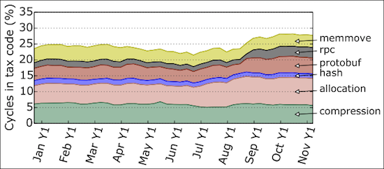

This led to my choice of <a href="https://developers.google.com/protocol-buffers/">Protocol Buffers</a> ('protobuf' in the figure, accounting for ~3-4% of all CPU cycles consumed) as the candidate software for hardware acceleration. Protocol Buffers are Google's "language-neutral, platform-neutral extensible mechanism for serializing structured data". In other words, this software (which consists of a *compiler* and *runtime library*) is used to efficiently <a href="https://en.wikipedia.org/wiki/Serialization">serialize</a> structured data (e.g., a C++ object) into a stream of bytes that are subsequently stored or transmitted over the network via <a href="https://en.wikipedia.org/wiki/Remote_procedure_call">RPC</a> to a receiving service that's able to reconstruct the original data structure from that stream of bytes and do what it needs with the data. Before continuing to the [Prerequisites](README.md#prerequisites) section, I recommend reading <a href="https://static.googleusercontent.com/media/research.google.com/en//pubs/archive/44271.pdf">Profiling a warehouse-scale computer</a> for more context, going through the <a href="https://developers.google.com/protocol-buffers/docs/cpptutorial">Protocol Buffers C++ tutorial</a> to understand how Protocol Buffers are used, and learning how Protocol Buffers are <a href="https://developers.google.com/protocol-buffers/docs/encoding">encoded</a>, as this is essential to the design of the hardware accelerator.

I chose to use Altera's (<a href="https://newsroom.intel.com/news-releases/intel-completes-acquisition-of-altera/">now Intel's</a>) <a href="https://www.altera.com/products/boards_and_kits/dev-kits/altera/arria-10-soc-development-kit.html">Arria 10 SoC Development Kit</a> as the platform for implementing Firework (i.e., the hardware-accelerated system). In the section [Choosing a development board](README.md#1-choose-a-development-board), I'll discuss what led to the choice of this specific board.

Firework consists of *six main components* that together implement a hardware-accelerated system and provide a means of measuring its performance. Each of these components are listed below, and I've provided a brief description of what they are and links to their repositories.

#### Firework's six main components

- [protobuf-serializer](protobuf-serializer/): the RTL design of a *4-stage pipelined, parallel processor* that performs Protocol Buffer serialization, written in Verilog, and packaged as a Quartus Prime project. The nomenclature stems from four pipeline stages in the design, two parallel datapaths for processing incoming varint and raw data, and a controller that consists of seven independent <a href="https://en.wikipedia.org/wiki/Finite-state_machine">finite-state machines</a> (FSMs). Also provided are several <a href="http://www.asic-world.com/verilog/art_testbench_writing1.html">testbenches</a> to verify the logic of each FSM as well as the processor as a whole.
- [a10-soc-devkit-ghrd](a10-soc-devkit-ghrd): the Arria 10 SoC <a href="https://rocketboards.org/foswiki/Documentation/A10GSRD151GHRDOverview">Golden Hardware Reference Design (GHRD)</a> modified with the protobuf-serializer processor added as a memory-mapped FPGA peripheral. This too is packaged as a Quartus Prime project (the main SoC subsystem is a Qsys component, more on that later).
- <a href="https://github.com/altera-opensource/linux-socfpga">linux-socfpga</a>: the Linux kernel built for the Arria 10 SoC platform, developed and maintained by Altera. We'll configure and compile the kernel from source to enable certain CONFIG options (e.g., CONFIG_KALLSYMS which provides kernel-level symbols) needed to profile the system.
- [driver](driver): a platform device driver for the protobuf-serializer FPGA peripheral implemented as a loadable kernel module. This driver provides an interface for modifications necessary to the protobuf runtime library and is ultimately responsible for relaying data from user space memory to the hardware peripheral residing in the FPGA.
- [protobuf](protobuf): a fork of Google's <a href="https://github.com/google/protobuf">Protocol Buffers</a> open source project. The runtime library is modified to send data to be serialized from user space memory to the protobuf-serializer FPGA peripheral for processing rather than the CPU.
- [profiling](profiling): this directory contains sample applications and a tutorial on using <a href="http://www.brendangregg.com/perf.html">perf-events</a> on the Arria 10 SoC Development Kit to profile both, *hardware-accelerated* and *standard* (software/CPU) systems and hence giving you the ability to compare their performance. Here we "close the loop" (i.e., we finally see how a user space application, compiled once, is executed in the *standard* and *hardware-accelerated* systems.

Although Firework covers the design of a hardware accelerator specifically for *Protocol Buffer serialization using an Arria 10 SoC Development Kit*, I was able to generalize the design process. The following sequence of high-level steps *are general enough to apply to any hardware accelerator project*, and the remainder of this tutorial provides in-depth coverage of each of these steps.

#### High-level steps in building a hardware-accelerated system

1. [Choose a development board](README.md#1-choose-a-development-board)
2. [Set up your development environment (OS, VNC server/client, EDA tools, licensing)](README.md#2-set-up-your-development-environment-os-vnc-serverclient-eda-tools-licensing)
3. [Understand the software you wish to accelerate](README.md#3-understand-the-software-you-wish-to-accelerate)
4. [Design and Implement the hardware accelerator (FPGA peripheral)](README.md#4-design-and-implement-the-hardware-accelerator-fpga-peripheral) 
5. [System integration (Arria 10 SoC GHRD)](README.md#5-system-integration-arria-10-soc-ghrd)
6. [Create an FPGA peripheral-aware Linux image](README.md#6-create-an-fpga-peripheral-aware-linux-image)
7. [Write a device driver (interface between FPGA peripheral and user space application)](README.md#7-write-a-device-driver-interface-between-fpga-peripheral-and-user-space-application)
8. [Closing the loop: modify the user space application](README.md#8-closing-the-loop-modify-the-user-space-application)
9. [Profiling the hardware-accelerated system](README.md#9-profiling-the-hardware-accelerated-system)

As a final note, this work can be quite challenging. It's essential to figure out a routine that works for you and knowing how to maintain a mental capacity for creativity over long periods of time, as this work is largely an art. For me, taking breaks when I feel the processor that is my brain overheating definitely helps. Another source of longevity are the inspiring words of world-renowned pop star <a href="https://www.youtube.com/watch?v=QGJuMBdaqIw">Katy Perry</a>.

## Prerequisites

Although not explicitly listed as a step, you should already have a project in mind, or at least an idea of which algorithm or software you want to accelerate. Otherwise, follow along with my choice of Protocol Buffers as described in the introduction and used throughout this tutorial.

### 1. Choose a development board

The first step is to choose a board that's appropriate for your project and goals. Since my objective was to build a hardware-accelerated system for a *datacenter application* that both, improves performance and *frees the CPU resource*, I was in search of a board that's capable of running Linux and could theoretically replace a <a href="https://en.wikipedia.org/wiki/White_box_(computer_hardware)">white box</a> server in a datacenter setting. The <a href="https://www.altera.com/products/boards_and_kits/dev-kits/altera/arria-10-soc-development-kit.html">Arria 10 SoC Development Kit</a> seemed to fit this description perfectly; it combines an <a href="https://www.altera.com/products/fpga/arria-series/arria-10/features.html">Arria 10 FPGA</a> with a <a href="https://developer.arm.com/products/processors/cortex-a/cortex-a9">dual-core ARM Cortex-A9</a> processor (called the <a href="https://www.altera.com/products/soc/portfolio/arria-10-soc/arria10-soc-hps.html">Hard Processor System, or HPS)</a> in a single <a href="https://en.wikipedia.org/wiki/System_on_a_chip">system-on-chip (SoC)</a> package. The FPGA fabric could be used to implement a custom <a href="https://en.wikipedia.org/wiki/Register-transfer_level">RTL</a> design that performs Protocol Buffer serialization while the HPS could be used to support both Linux and the user space application. Plus, think about how cool you'd look with one of these bad boys sitting on your desk:

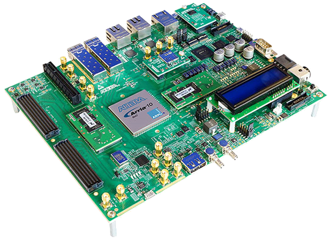

Although it is easiest to replicate and extend Firework using the Arria 10 SoC Development Kit, the main component - [protobuf-serializer](protobuf-serializer/) (i.e., the *hardware accelerator*) - is written in <a href="https://en.wikipedia.org/wiki/Verilog">Verilog</a> (with the exception of the <a href="https://en.wikipedia.org/wiki/FIFO_(computing_and_electronics)">FIFOs</a> used in the design - I pulled them from <a href="https://www.altera.com/en_US/pdfs/literature/ug/archives/ug-fifo-14.1.pdf">Altera's IP Cores library</a>) and is compatible with other ARM-based systems. The <a href="https://en.wikipedia.org/wiki/Modularity">modularity</a> of the hardware accelerator stems from the fact that it's designed as an <a href="https://www.arm.com/products/system-ip/amba-specifications">ARM AMBA AXI</a> *slave peripheral* (i.e., its top-level I/O ports implement an AXI <a href="https://en.wikipedia.org/wiki/Master/slave_(technology)">slave interface</a>) and ARM CPUs serve as AXI *masters*. More details of the hardware accelerator design and ARM AMBA AXI bus protocol are covered in the sections [Designing and Implementing the hardware accelerator (FPGA peripheral)](README.md#4-design-and-implement-the-hardware-accelerator-fpga-peripheral) and [System integration (Arria 10 SoC GHRD)](README.md#5-system-integration-arria-10-soc-ghrd).

At a minimum, you'll need a board with an FPGA (i.e., programmable logic) to implement a hardware accelerator. Other board requirements are specific to your project and goals. Questions you might ask to determine these requirements include:

- Is it a standalone algorithm or component of a larger software project I wish to accelerate? (i.e., do I need a CPU?)
- Is it a bare metal or Linux application (i.e., do I require the use of an operating system)?
- Am I replacing existing hardware? How does my design fit in to the larger system?
- Does it require network access?
- Am I working with large amounts of data? What are my storage requirements? 
- Which bottlenecks in the algorithm/software do I wish to alleviate?
- Would a custom hardware design outperform the existing CPU/memory architecture?

Don't underestimate the importance of this step. Acquiring a board can be an investment, and its fit with your project will certainly impact its success. Spending time asking and answering questions like these will also help to reaffirm your understanding of your project and goals.

### 2. Set up your development environment (OS, VNC server/client, EDA tools, licensing)

Before we get to the fun, we need to put our IT hats on. The next step is to set up your *hardware development environment*. Your setup is primarily going to be influenced by the development board you choose, the corresponding set of <a href="https://en.wikipedia.org/wiki/Electronic_design_automation">EDA tools</a> needed to implement designs on that board, and the computing resources available to you. The complexity of your project's design could also influence your setup; larger, more complex designs might require you to use premium, licensed versions of the EDA tools for full functionality. (Personally, I think this outdated business model is something the hardware industry needs to work on since the cost of the development board and software licenses alone adds yet another barrier to innovation in the hardware space. I'm happy to see Amazon taking steps in the right direction; they've begun rolling out <a href="https://aws.amazon.com/ec2/instance-types/f1/">F1 Instances</a> in their EC2 cloud providing access to Xilinx FPGAs for hardware acceleration. I haven't tried using them myself, but I imagine it's makes getting started with a hardware accelerator project much easier and cheaper than through the method I describe below.) 

For me, working with the Arria 10 SoC Development Kit meant installing <a href="http://dl.altera.com/?edition=standard&platform=linux&download_manager=direct">then-Altera's EDA tools</a> on a remote server I had access to via my company's <a href="https://en.wikipedia.org/wiki/Local_area_network">LAN</a>. As it turns out, setting up a hardware development environment on a remote server is not a trivial task. Fortunately for you, I've gone through the process and will cover the steps below. Although your setup may be different (board, tools, etc.), hopefully this section will give you an idea of what it takes to set up your environment.

I used the following server, operating system, and <a href="https://en.wikipedia.org/wiki/Virtual_Network_Computing">VNC</a> software (for remote desktop access) in my setup:
- <a href="http://www.dell.com/downloads/global/products/pedge/dell-poweredge-r720xd-spec-sheet.pdf">Dell PowerEdge R720xd</a> (server running the EDA tools)
- <a href="https://www.centos.org/download/">CentOS 7</a> (operating system running on the server)
- <a href="http://tigervnc.org/">TigerVNC</a> (VNC server software running on the server)
- <a href="https://www.realvnc.com/en/connect/download/viewer/">RealVNC VNC Viewer</a> (VNC client software running on my laptop)

My macbook served as the sole interface to both the remote server (via VNC client) where I installed the EDA tools and the Arria 10 SoC Development Kit (via a terminal + <a href="https://en.wikipedia.org/wiki/Minicom">minicom</a> serial connection) which sat on my desk. Note that any laptop with the proper VNC client and serial communication software (minicom, <a href="http://www.putty.org/">PuTTY</a>, etc.) installed should be fine. I'm still fascinated by the setup I ended up with: 3 computers, 2 geographic locations, and 1 keyboard/monitor to access them all simultaneously:

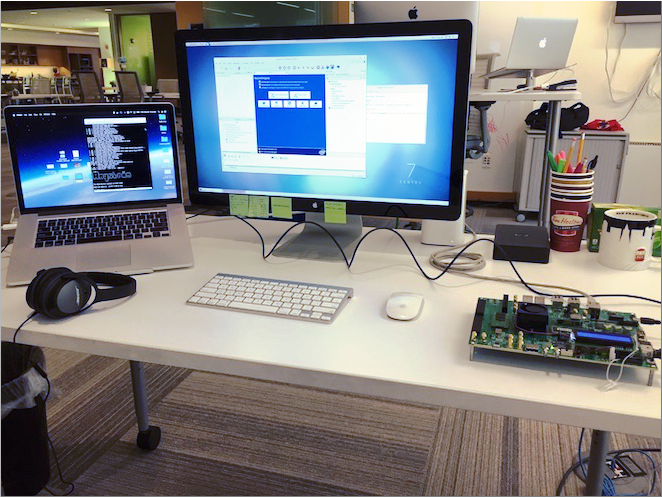

The reason why I used a server equipped with two <a href="https://ark.intel.com/products/64595/Intel-Xeon-Processor-E5-2670-20M-Cache-2_60-GHz-8_00-GTs-Intel-QPI">Intel Xeon E5-2670 CPUs</a> (each with 8, <a href="https://en.wikipedia.org/wiki/Simultaneous_multithreading">2-way SMT</a> cores), 256 GB of RAM, and 8 TB of storage is that <a href="https://www.altera.com/products/design-software/fpga-design/quartus-prime/overview.html">Quartus Prime</a> - the main EDA tool we'll be using for hardware development - has a "recommended system requirement" of 18-48 GB of RAM when working with Arria 10 devices. My laptop and I'm guessing most others are simply not powerful enough to support this software. I also know from experience that hardware compilation can take quite some time, so 32 parallel <a href="https://en.wikipedia.org/wiki/Thread_(computing)">threads</a> of execution will definitely come in handy, if fully utilized (hint: `-j 32` tells `make` to <a href="https://www.gnu.org/software/make/manual/html_node/Parallel.html">execute 32 recipes in parallel</a>).

Choosing CentOS 7 as the operating system to install on the server is less obvious. If you look at the <a href="http://dl.altera.com/requirements/16.1/">Operating System Support</a> for Quartus Prime and other EDA tools we'll be using, notice that only 64-bit variants of Windows and Red Hat Enterprise Linux (RHEL) are supported. Well, RHEL isn't free unlike most other Linux distributions (thanks to the '<a href="https://en.wikipedia.org/wiki/Enterprise_software"E</a>') so unless you already have access, CentOS is <a href="https://www.centos.org/about/">RHEL's altruistic cousin</a>. Although CentOS 7 is not explicitly supported, it works. Believe me. If you prefer to use Windows, that's fine too (well it's not, but that's beyond the scope of this tutorial).

It's quite a humbling experience to set up a server for the first time, and you'll certainly think twice before sending the next angry ticket to your IT support desk. Without further ado, here are the steps it took to set up my development environment.

#### Remotely installing CentOS 7 on a Dell PowerEdge R720xd server

To access the remote server, we'll initially use its built-in <a href="http://www.dell.com/learn/us/en/15/solutions/integrated-dell-remote-access-controller-idrac">integrated Dell Remote Access Controller (iDRAC)</a>. This tool has many powerful features, including the ability to monitor logged events, power cycle the server, and even install an OS - all remotely. Assuming the server is connected to your <a href="https://en.wikipedia.org/wiki/Local_area_network">LAN</a>, has been assigned an <a href="https://en.wikipedia.org/wiki/IP_address">IP address</a>, and the iDRAC is enabled, open any web browser and enter its IP address to access the iDRAC login screen. It should look something like this:

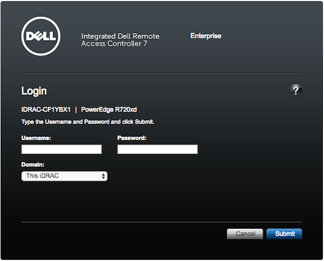

If this is your first time using the iDRAC, the <a href="http://en.community.dell.com/techcenter/b/techcenter/archive/2013/07/16/idrac7-now-supports-default-password-warning-feature">default username and password</a> are **root** and **calvin**, respectfully. When you log in, you'll see a summary page with several tabs (on the left side of the page and on the top of some pages) that provide a plethora of stats/info about your server. Now, we're ready to use the iDRAC to remotely install CentOS 7 on the server.

1. Download the <a href="https://www.centos.org/download/">CentOS 7 DVD ISO</a> image. Choose *DVD* instead of *Minimal* since we'll need to install a <a href="https://www.gnome.org/">GNOME Desktop</a> on the server.

2. Log in to the iDRAC and go to the *System Summary* page (default page upon login).

3. In the *System Summary* > *Virtual Console Preview* window, click **Launch**. This will download a Virtual Console Client called *viewer.jnlp*.

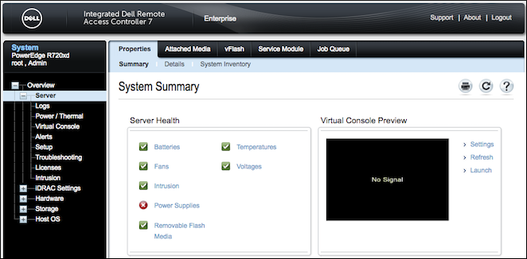

4. Run the *viewer.jnlp* Java application. Your computer may complain about it being from an unidentified developer, but there's a way around this. Right click *viewer.jnlp* > *Open With* > *Java Web Start (default)* and click **Open** in the window that appears.

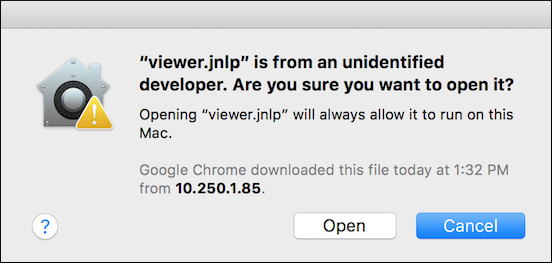

5. This will open another window, *Security Warning*. Click **Continue**.

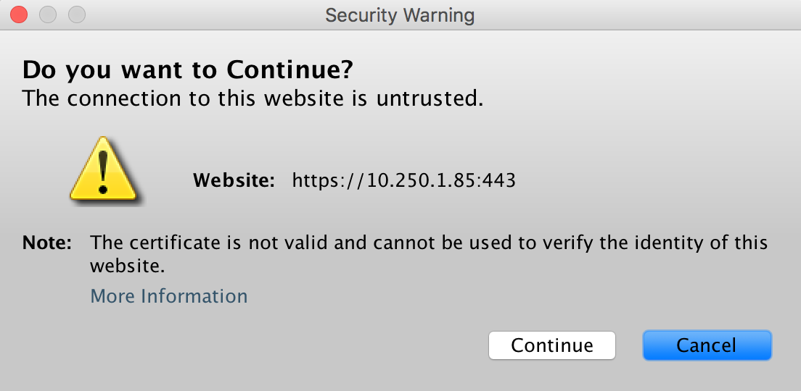

6. You can never be too cautious. This will open a new *Warning - Security* window that asks, *Do you want to run this application?* I think you know the answer. Click **Run**.

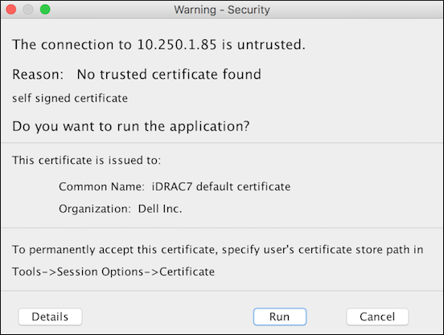

7. Great, we've finally opened the Virtual Console Client! Click anywhere in the window so that its menu appears in the <a href="https://support.apple.com/en-us/HT201956">OS X menu bar</a> at the top of your screen. Select *Virtual Media* > *Connect Virtual Media*. I couldn't take a screenshot of this step because when the Virtual Console Client is in focus, it captures all keyboard events. See the menu bar in the screenshot below.

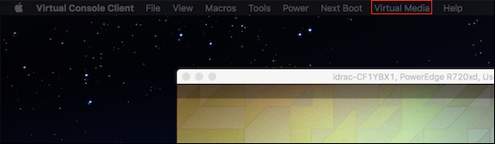

8. Once connected, select *Virtual Media* > *Map CD/DVD ...* and select the CentOS 7 ISO image we just downloaded. Then click **Map Device**.

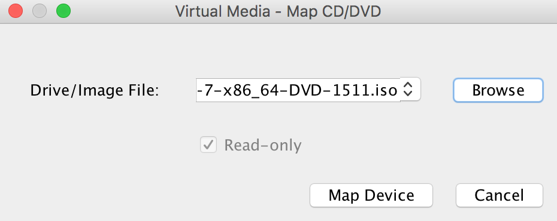

9. In the Virtual Console Client menu again, select *Next Boot* > *Virtual CD/DVD/ISO*. Click **OK** in the window that appears. This tells the server to boot from the CentOS 7 installer ISO we downloaded on the next boot.

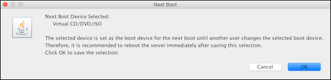

10. In the Virtual Console Client menu, select *Power* > *Reset System (warm boot)*. You'll see "No Signal" appear on the window followed by the CentOS 7 installer screen when the server finishes rebooting. With *Install CentOS 7* highlighted, press **enter** to begin installation.

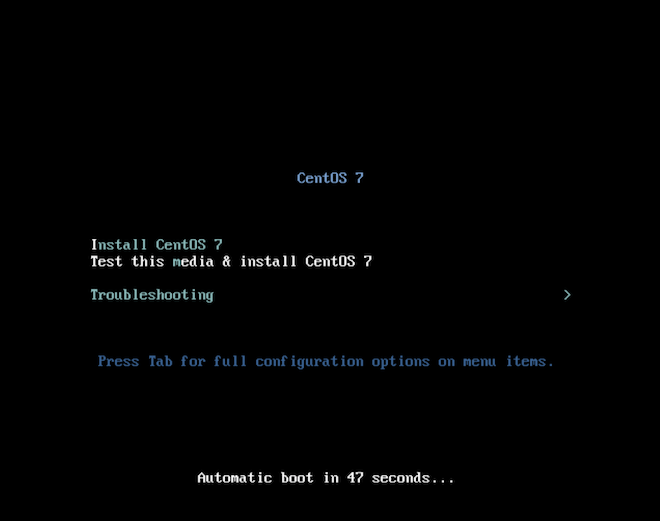

11. Follow the promts until you get to the *Software Selection* window. Select *GNOME Desktop* as your Base Environment. Select the *Legacy X Window System Compatibility*, *Compatibility Libraries*, and *Development Tools* add-ons in the list to the right. Click **Done** when your window looks like the one below.


12. Select a disk to install to, select *Automatically configure partitioning.*, and (optionally) encrypt your data; I didn't. Click **Done** and proceed with the installation by selecting **Begin Installation** in the main menu. 

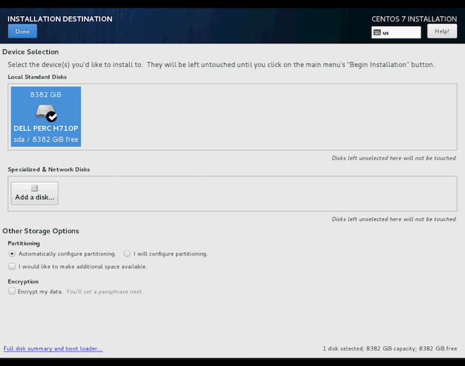

13. During the installation, it'll ask you to create a user account. Make the user an **administrator** and **set the root password**. DON'T FORGET TO SET THE ROOT PASSWORD. We'll need root access when installing the VNC server <a href="https://en.wikipedia.org/wiki/Daemon_(computing)">daemon</a>. Click **Reboot** when the installation completes and voila!

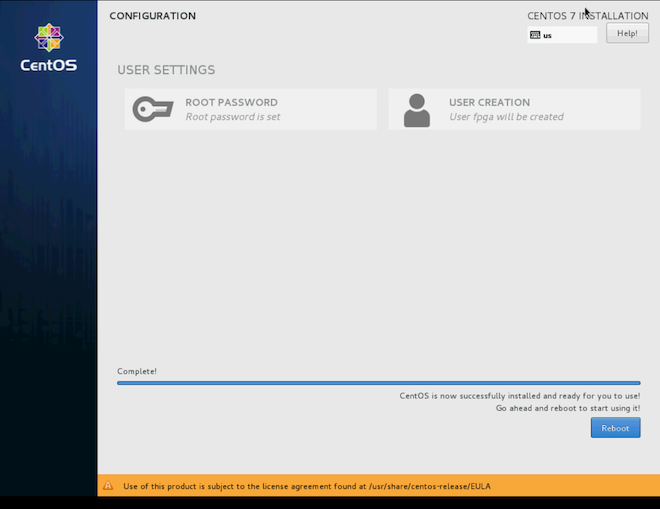

The server is now running CentOS 7. In the initial boot, it'll ask you to accept a license. Follow the prompts on the screen to accept the license, let it finish booting, and log in as the user you just created. Keep the Virtual Console Client open; we'll use it to set up the VNC server/client software in the next step.

#### Setting up VNC server and client software

If you're not familiar with <a href="https://en.wikipedia.org/wiki/Virtual_Network_Computing">VNC</a>, the basic idea is that you're interacting with a remote computer's desktop environment. That is, your keyboard and mouse events are sent to that computer over the network, and the corresponding GUI actions are relayed back to your screen. This is useful when you need to remotely access an application that has a GUI. As you may have guessed, this is the case of Quartus Prime and other EDA tools we'll be using.

I used <a href="http://tigervnc.org/">TigerVNC</a> as the *server* software running on the Dell PowerEdge R720xd and <a href="https://www.realvnc.com/en/connect/download/viewer/">RealVNC VNC Viewer</a> as the *client* softawre running on my macbook. I followed <a href="https://www.digitalocean.com/community/tutorials/how-to-install-and-configure-vnc-remote-access-for-the-gnome-desktop-on-centos-7">this tutorial</a> by Sadequl Hussain to get the VNC setup working for me, and I've summarized the steps below. I recommend going through his tutorial as it does a great job explaining each step in detail!

##### VNC server

1. Using the Virtual Console Client from the previous section, make sure you're logged in as the user you created and open a terminal. First, let's install the TigerVNC server software.

```
sudo yum install tigervnc-server
```

2. The previous step creates a template <a href="https://www.freedesktop.org/software/systemd/man/systemd.service.html">service unit configuration file</a> for the `vncserver` service in `/lib/systemd/system/`. We need to copy this file to `/etc/systemd/system` and make a few modifications in order to have <a href="https://www.freedesktop.org/wiki/Software/systemd/">systemd</a> automatically start this service for the logged in user when the server is reset or turned on.

```
sudo cp /lib/systemd/system/vncserver@.service /etc/systemd/system/vncserver@:5.service
```

3. Using the text editor of your choice (e.g., `vim`), open the file and replace every `<USER>` instance with the name of the user you created. I created a user with the name `fpga` and highlight where those changes are made in the screenshot below. Also add the option `-geometry 2560x1440` to the `ExecStart=` line replacing `2560x1440` with the resolution of the screen you plan to run the VNC Viewer client on. This will make full screen mode look pretty on your laptop or monitor.

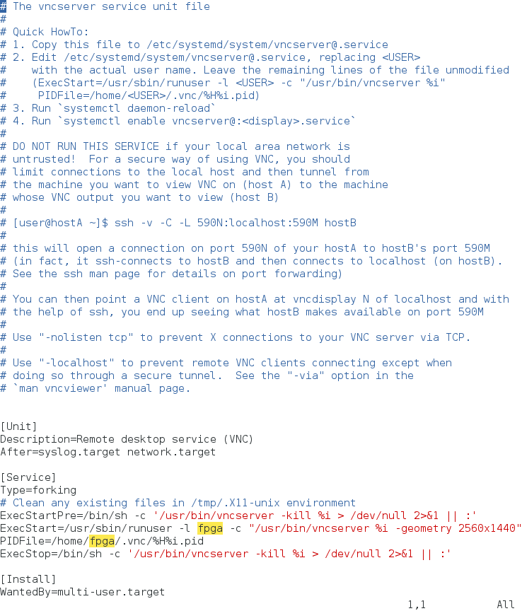

4. Use <a href="https://www.freedesktop.org/software/systemd/man/systemctl.html">systemctl</a> to reload the systemd manager configuration.

```
sudo systemctl daemon-reload
```

5. Enable the `vncserver` unit instance. Note the number `5` in `vncserver@:5.service` was chosen arbitrarily but means the `vncserver` running for this user will be listening for incoming connections on port `5905`.

```
sudo systemctl enable vncserver@:5.service
```

6. Configure the <a href="https://www.linode.com/docs/security/firewalls/introduction-to-firewalld-on-centos">firewall used by CentOS 7</a> to allow traffic through port `5905`.

```
sudo firewall-cmd --permanent --zone=public --add-port=5905/tcp
sudo firewall-cmd --reload
```

7. In the terminal, run `vncserver` and it'll ask you to set a password for opening VNC connections with this user. Note, this should be from the user's CentOS 7 login password.

8. With all the configurations made, let's make sure `vncserver` is running for this user before setting up the VNC Viewer client software.

```
sudo systemctl daemon-reload
sudo systemctl restart vncserver@:5.service
sudo systemctl status vncserver@:5.service 
```

You should see `active (running)` in the output of the last command:

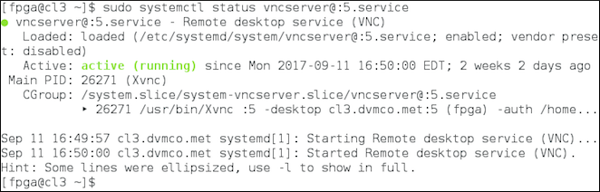

##### VNC client

1. Now that we have our VNC server running, let's set up the VNC client software on the device we'll use to remotely access the server (macbook for me). On your laptop, download the <a href="https://www.realvnc.com/en/connect/download/viewer/">RealVNC VNC Viewer</a> client, install, and open it. In the *VNC Server* field, enter `127.0.0.1:5900` but don't click **Connect** just yet. 

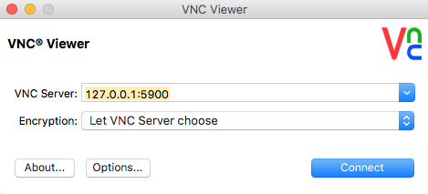

If you're familiar with computer networking, you may be wondering why we entered the IP address of the <a href="https://en.wikipedia.org/wiki/Localhost">localhost</a> and port `5900` instead of the IP address of our remote server and port `5905` (the port we set the VNC server to listen to for incoming connections). That's because after the initial authentication, all data communicated between the VNC server and client is unencrypted and hence susceptible to interception. To secure this communication channel, we'll set up an <a href="https://en.wikipedia.org/wiki/Tunneling_protocol">SSH tunnel</a> encrypting the data communicated over the network.

2. Open a terminal and enter the following command, replacing `<ip-address>` with the IP address of your server and `<user>` with the name of user you created when installing CentOS 7. 

```
ssh -L 5900:<ip-address>:5905 <user>@<ip-address> -N
```

It'll ask for the user's CentOS 7 password. Enter the password and it should leave the terminal in a hanging state - this means we've established our SSH tunnel and are ready to connect to the VNC server.

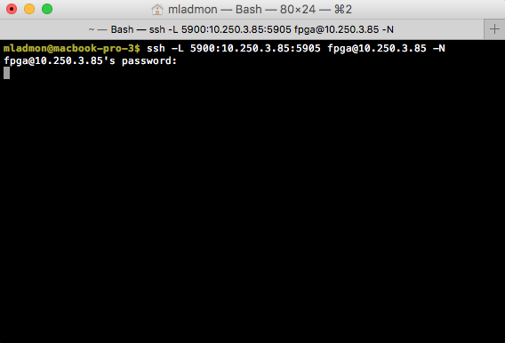

3. Click **Connect** in the VNC Viewer client and you should see the following warning, which we can now safely ignore. 

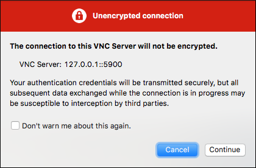

4. Click **Continue**. Enter the passowrd you set up for the VNC server and click **OK**.

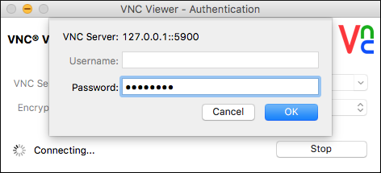

5. Congratulations! We just established our first remote desktop session with the CentOS 7 server! If you hover your curser above the top-middle of the window, a menu will appear. Click on the icon in the middle to enter *Full screen mode*. If you set the `-geometry` option with your screen's resolution, it should take up entire screen. Click on this icon again to exit *Full screen mode*.

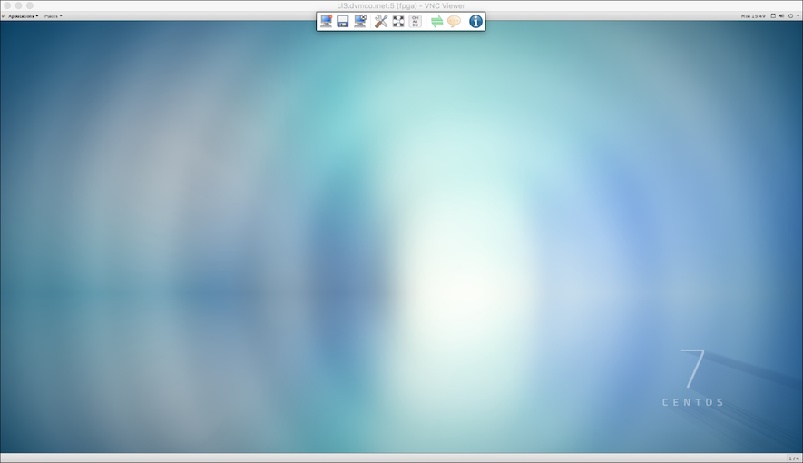 

Leave the VNC client session open; this is now our main way to interact with the remote server. We'll use it to first install and then use the EDA tools to design our FPGA peripheral hardware.

#### Installing Intel's EDA tools

Some <a href="https://en.wikipedia.org/wiki/Electronic_design_automation">EDA tools</a> are free while others require a paid license to work. There may be free versions of tools that normally require a license with limited features, but the features included may be enough to satisfy your needs. Although I used licensed tools, I recommend using free versions when possible. You may even consider choosing a development board based on the "free-ness" of the tools needed for compiling designs for that board (e.g., I later realized that a licensed version of Quartus Prime was required to work with Arria 10 development boards).

For the hardware development in this project, I used the following EDA tools:
- <a href="https://www.altera.com/products/design-software/fpga-design/quartus-prime/overview.html">Quartus Prime Standard Edition</a>
- <a href="https://www.altera.com/products/design-software/fpga-design/quartus-prime/features/qts-qsys.html">Qsys System Integration Tool</a>
- <a href="https://www.altera.com/products/design-software/model---simulation/modelsim-altera-software.html">ModelSim-Intel FPGA Edition</a> (formerly ModelSim-Altera Edition)

Note that although I used version `16.0` of these tools during initial development, I've since updated my environment with the latest release of these tools (`17.1` at the time of writing this tutorial) and have updated the designs included in this repository work with them. Although the general design process is the same, I've noticed newer versions of the tools are more stable and include some key bug fixes, one of which I take credit for and describe in the licensing section.

The following steps should be completed on the CentOS 7 server through your open VNC client session.

1. From Intel's <a href="http://dl.altera.com/?edition=standard&platform=linux&download_manager=direct">Download Center</a>, download `version 17.1` of the *Quartus Prime Standard Edition* software and *device support for the Arria 10* (parts 1, 2, and 3). Select **Linux** as the operating system and **Direct Download** as the download method (setting up the *Akamai DLM3 Download Manager* takes extra effort and is unnecessary for this one-time download). You have a few options for downloading the necessary files. I avoided the *Complete Download* since it's a pretty huge file (26.8 GB) and contains unnecessary device support. Instead, download the following files from the *Multiple File Download* section:
- Quartus Prime Standard Edition Software (Device support not included)
- Quartus Prime Device Package 1 (Arria 10)

2. You should now have the following <a href="https://en.wikipedia.org/wiki/Tar_(computing)">tarballs</a> sitting in your `~/Downloads` (or other default) directory:
- `Quartus-17.1.0.590-linux.tar`
- `Quartus-17.1.0.590-devices-1.tar`

Before we begin extracting and installing the software, it's important to choose a root directory for all of your development; several files and directories will be generated as we progress through the tutorial, and without organization, things can get unwieldy fast. Out of habit, I chose `~/workspace` as my root directory. In all code blocks to follow in this tutorial, replace every instance of `~/workspace` with the location of your root directory.

3. Extract `Quartus-17.1.0.590-linux.tar` and run the `setup.sh` script.

```
cd ~/Downloads
tar -xf Quartus-17.1.0.590-linux.tar
./setup.sh
```

This will open an installer GUI. Click **Next**, accept the the agreement, and click **Next** again to reach the *Installation directory* window. By default, it chooses `~/intelFPGA/17.1`. Replace this path with the root directory you chose followed by `intelFPGA/17.1`. Your window should look similar to the screenshot below, with `fpga` replaced by the name of your user:

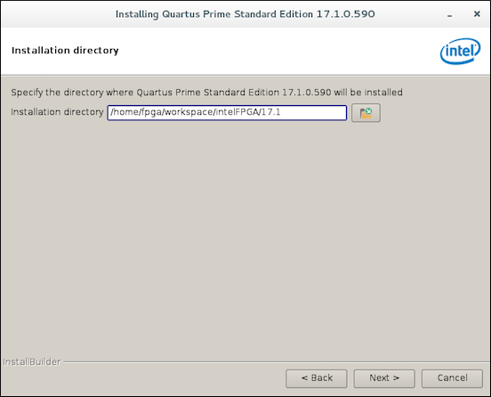

4. Click **Next** to reach the *Select Components* window. Select the following components:

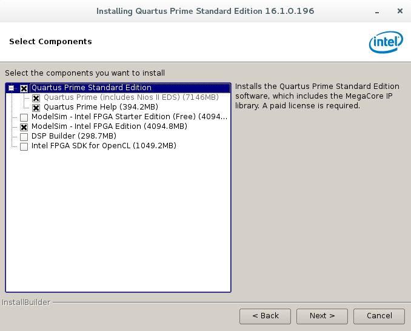

5. Click **Next** twice to proceed with the installation. You'll receive the following *Info* pop-up dialog which you can safely ignore (we'll install Arria 10 device support files next):

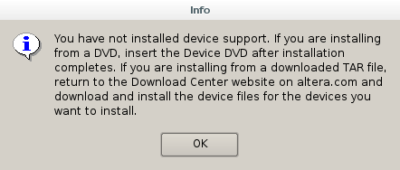

When the installation is complete, the following window appears letting you optionally create a desktop shortcut for Quartus Prime. Click **Finish** to exit the installer.

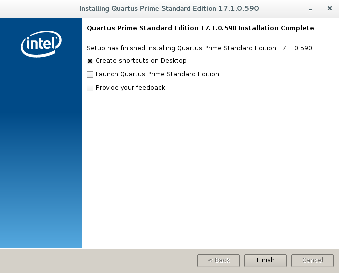

6. Extract `Quartus-17.1.0.590-devices-1.tar` and run the `dev1_setup.sh` script.

```
tar -xf Quartus-17.1.0.590-devices-1.tar
./dev1_setup.sh
```

An installer similar to the one for Quartus Prime will open, and we'll use it to install Arria 10 device support for Quartus Prime. Click **Next**, accept the agreement, and click **Next** again to reach the *Installation directory* window. Like before, replace the default path with your root directory followed by `intelFPGA/17.1`, and click **Next**. This takes us to the *Select Components* window. Check the **Devices** box which automatically selects **Arria 10 Part 1**, **Arria 10 Part 2**, and **Arria 10 Part 3**: 

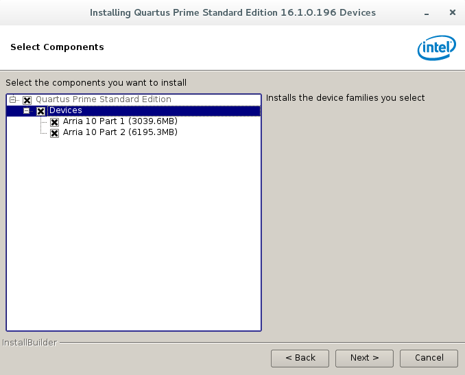

Click **Next** twice to proceed with the installation, and click **Finish** to exit the installer.

We now have Quartus Prime Standard Edition, the Qsys System Integration Tool (embedded in Quartus Prime), and ModelSim-Intel FPGA Edition installed with support for Arria 10 devices on the remote CentOS 7 server. Yay!

8. If you didn't create a desktop shortcut, let's add the Quartus Prime binary (`quartus`) to the `PATH` <a href="https://en.wikipedia.org/wiki/Environment_variable">environment variable</a> so you can simply type `quartus` in a terminal to open the tool. I'll leave it to you to decide whether you want to do this permanently (i.e., editing `~/.bashrc`) or temporarily (i.e., `export PATH=$PATH:<path-to-quartus>` in an open terminal). The path to `quartus` is: `~/workspace/intelFPGA/17.1/quartus/bin/`.

If you were to open Quartus Prime now, a *License Setup Required* pop-up dialog would appear (see screeshot below). In the next section, we'll go over how to serve the license we acquire from Intel which gives us full access to Quartus Prime Standard Edition, ModelSim-Intel FPGA Edition, and Arria 10 device support and eliminates this pop-up dialog (in version Quartus Prime `17.1` at least, earlier version may still require initial setup).

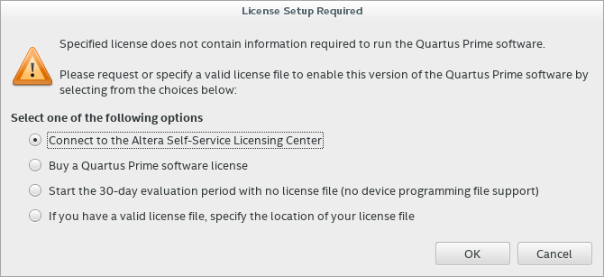

#### Setting up and serving a license

Remember when I said setting up an environment for hardware development is a nontrivial task? Well, licensing EDA tools is the crux of its nontrivial-ness. I don't even know where to begin, from the difficulty in identifying which EDA tools or features of these tools (e.g., the MegaCore IP Library in Quartus Prime) require licenses to whether I'll even be using certain tools or features for my project. That's only the beginning; where and how to even acquire a license isn't obvious, there are different license types to choose from (*fixed* and *floating*), and when you finally receive a license, you need to add some not-so-obvious information to the file before it can be properly served by a <a href="https://www.ics.com/files/docs/bx/5/bxref/ref_5f.htm">license manager</a> (that's right, yet another piece of software required to get Quartus Prime and other EDA tools working).

Recall that I mentioned taking credit for a bug that was fixed in later releases of Quartus Prime than the one I originally used (version `16.0`). I'll describe that bug now [queue <a href="https://youtu.be/9jK-NcRmVcw">The Final Countdown</a>]. The license you receive is tied to the <a href="https://en.wikipedia.org/wiki/MAC_address">MAC address</a> of the <a href="https://en.wikipedia.org/wiki/Network_interface_controller">NIC</a> of the computer you're planning to run the software on. The purpose of doing this is to limit the license's use to only one, uniquely-identified computer. That's fine, it's a way of making sure a license only works for the intended user (who paid for it). Well, thanks to an act of incredibly poor engineering, Quartus Prime used to **ONLY recognize NICs that are named `eth0` from Linux's perspective**. <a href="https://en.wikipedia.org/wiki/Consistent_Network_Device_Naming">Upon further investigation</a>, I found out that CentOS 7's choice of `em1`, `em2`, etc. as the names for the network interfaces on my server is actually the modern naming convention used for NICs (the `eth0`, `eth1`, etc. naming convention is obsolete). The only way to get Quartus Prime to recognize I had the proper license being served, <a href="http://www.sysarchitects.com/em1_to_eth0">like this guy</a> I had to rename my `em1` NIC to `eth0`, a non-trivial task. 

Luckily, I complained about this bug and you won't have to worry about it (Quartus now recognizes all NICs on your machine). I'll try to also spare you from reading this <a href="https://www.altera.com/content/dam/altera-www/global/en_US/pdfs/literature/manual/quartus_install.pdf">46-page manual on licensing</a> by summarzing the necessary steps to edit and serve your license below.

1. Acquire a license. I wouldn't bother with the <a href="https://www.altera.com/mal-all/mal-signin.html?targetResource=https%3A%2F%2Fsso.altera.com%2Fpf%2Fadapter2adapter.ping%3FSpSessionAuthnAdapterId%3DOTKSiebel%26TargetResource%3Dhttps%253A%252F%252Fmysupport.altera.com%253A443%252FAlteraLicensing%252Flicense%252Findex.html">Self-Service Licensing Center</a>. Instead <a href="https://www.altera.com/about/contact/contact.html">contact an Intel licensing representative</a> directly and ask for a license for *Quartus Prime Standard Edition* and *ModelSim-Intel FPGA Edition*. Quartus Prime Standard Edition (or Pro) is <a href="https://www.altera.com/products/design-software/fpga-design/quartus-prime/download.html">required when working with Arria 10 devices</a> and is used to implement the FPGA hardware design. I used ModelSim-Intel FPGA Edition to run simulations and perform <a href="http://quartushelp.altera.com/15.0/mergedProjects/reference/glossary/def_funsim.htm">functional verification</a> of each subsystem of the design as well as the hardware accelerator as a whole. Although I haven't tried, you may be able to run the simulations I've included using the free version of ModelSim (ModelSim-Intel FPGA Starter Edition).

2. You should now have received a license from Intel. Create a directory called `license` in your root directory and move the license there. I used `scp` to copy the license from my macbook to the CentOS 7 server (see screenshot below as an example of using this command). Accessing your email from the server directly is another option.

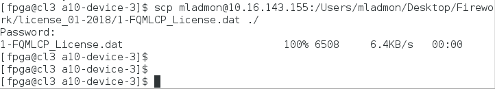

3. We need to edit the license before it can be served. First, **copy** and rename the license to `/usr/local/flexlm/licenses/license.dat`. This is where we'll tell the <a href="https://www.ics.com/files/docs/bx/5/bxref/ref_5f.htm">FLEXlm license manager</a> to look for a license file called `license.dat` to serve.

```
sudo mkdir -p /usr/local/flexlm/licenses
sudo cp ~/workspace/license/1-FQMLCP_License.dat /usr/local/flexlm/licenses/license.dat
```

4. Using the text editor of your choice, open `license.dat` and add the following lines near the top. See the screenshot below to see where I made the changes.

```
SERVER <hostname> <MAC address of NIC>
VENDOR alterad "<your-working-dir>/intelFPGA/17.1/quartus/linux64/alterad"
VENDOR mgcld "<your-working-dir>/intelFPGA/17.1/modelsim_ae/linuxaloem/mgcld"
USE_SERVER
```

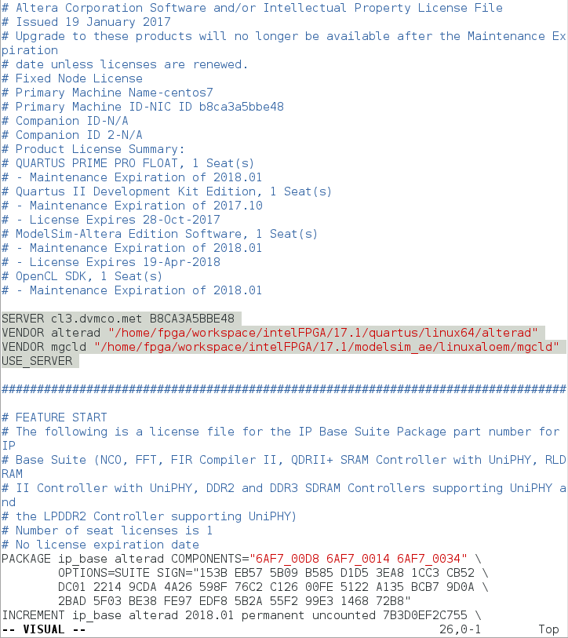

To obtain your server's `<hostname>`, run `uname -n` in a terminal.

You should already know the MAC address of your NIC since it was needed to acquire the license. Just in case, run `ifconfig` to list the network interfaces on your machine, identify which one you're actively using (I have `em1` connected to the network), and the MAC address will be the 12-digit, colon-separated hex value following `ether`:

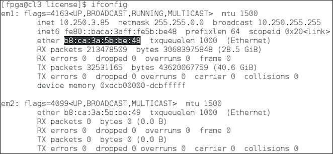

The next two `VENDOR` lines specify the locations of the Quartus Prime and ModelSim <a href="https://en.wikipedia.org/wiki/Daemon_(computing)">daemons</a> that FLEXlm runs to serve their features. These daemons were included with the Quartus Prime Standard Edition and ModelSim-Intel FPGA Edition installations.

5. Now we're ready to serve our license! Run the following command to start the FLEXlm license manager and serve our license. Note that FLEXlm was also included in the Quartus Prime installation.

```
cd ~/workspace
intelFPGA/17.1/quartus/linux64/lmgrd -c /usr/local/flexlm/licenses/license.dat
```

... and we were so close! I'm referring to the error `/lib64/ld-lsb-x86-64.so.3: bad ELF interpreter: No such file or directory` you probably received the first time running the license manager:

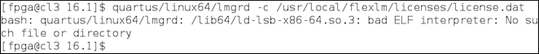

Giving credit to <a href="https://software.intel.com/en-us/articles/flexlm-license-manager-20-may-fail-when-lsb-3-is-not-met">this post</a>, there's nothing a simple <a href="https://en.wikipedia.org/wiki/Symbolic_link">symbolic link</a> can't fix! We have a functional 64-bit <a href="https://linux.die.net/man/8/ld-linux">program loader</a> running on the CentOS 7 server, I promise; the <a href="https://stackoverflow.com/questions/1951742/how-to-symlink-a-file-in-linux">symlink</a> we'll create let's FLEXlm call it `ld-lsb-x86-64.so.3` if it likes.

```
sudo ln -s /lib64/ld-linux-x86-64.so.2 /lib64/ld-lsb-x86-64.so.3
```

6. Run the command to start FLEXlm again and voila! You'll see a log of information from FLEXlm `(lmgrd)`, the Altera daemon `(alterad)`, and the ModelSim daemon `(mgcld)`. Completely irrelevant, but I'm guessing `lmgrd` stands for *license manager daemon*.

7. Uh-oh! Upon further inspection, we see that FLEXlm actually failed to launch the ModelSim daemon (`mgcld`) at time `23:42:24`:

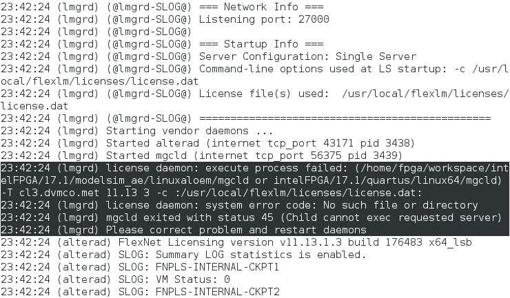

That's not good. What could be the problem? Well, I tried running the daemon directly and received the following error message: 

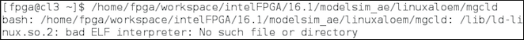

That looks familiar! This time it's the 32-bit version of the program loader that's missing, but why does `mgcld` want to use a 32-bit program loader on a 64-bit architecture? If we revisit the <a href="https://www.altera.com/support/support-resources/download/os-support.html">Operating System Support</a> page and look closely at the *ModelSim-Intel FPGA Edition* entry in the table, there's a supercript on the checkmark -  - that corresponds to the following note:

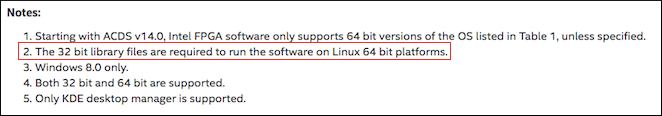

So obvious! Shame on us. Let's install the 32-bit program loader, `ld-linux.so.2`, which belongs to the `glibc` package.

```
sudo yum install ld-linux.so.2
```

Note, `i686` in the output refers to Intel's 32-bit <a href="https://en.wikipedia.org/wiki/X86">x86</a> architecture while `x86_64` refers to <a href="https://en.wikipedia.org/wiki/X86-64">64-bit</a> architecture. Let's run `mgcld` again to confirm we fixed the issue.

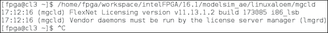

That looks promising!

8. Restart FLEXlm to successfully serve both Quartus Prime and ModelSim features this time. First, use `ps` to identify the currently-running `lmgrd`'s <a href="https://en.wikipedia.org/wiki/Process_identifier">process ID (PID)</a> and kill it with the `kill -9` command.

```
ps aux | grep lmgrd
sudo kill -9 <PID>
```

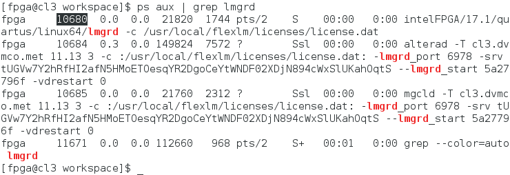

Now we can start FLEXlm again:

```
cd ~/workspace
intelFPGA/17.1/quartus/linux64/lmgrd -c /usr/local/flexlm/licenses/license.dat
```

As long as you don't see any error messages in the log, all features of Quartus Prime and ModelSim should now be properly served. Here's what the tail end of my log looks like:

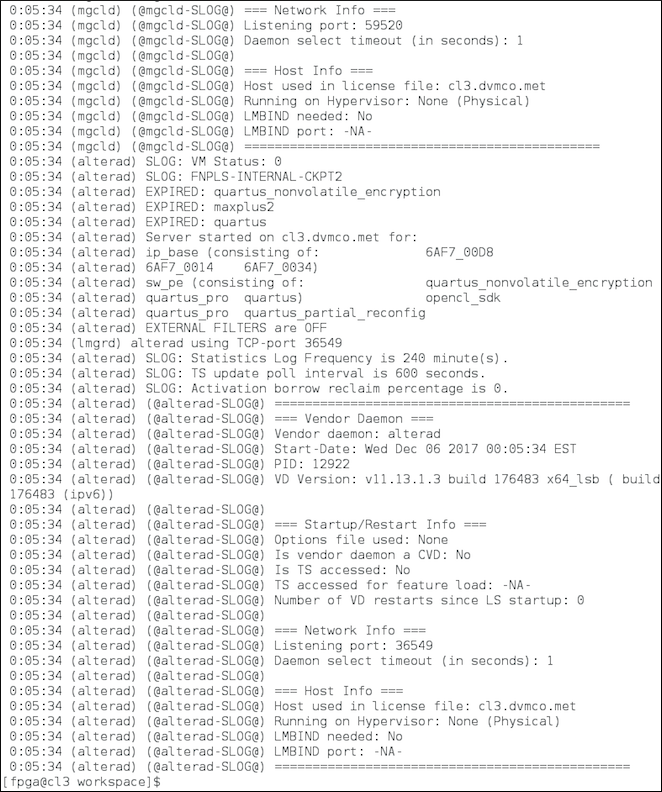

9. Open Quartus Prime. Note, if you're using version `17.1` or later, the license should automatically be recognized and you can skip ahead to step 11. Otherwise, you'll see the *License Setup Required* pop-up dialog appear again, but this time we're ready to specify the license we're using. Select *If you have a valid license file, specify the locaiton of your license file* option and click **OK**. 

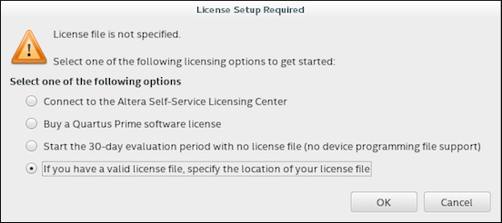

10. Specify the locaiton of the license file and click **OK**.

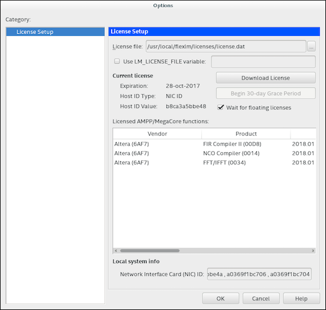

11. Voila! We now have Quartus Prime Standard Edition running with its (and ModelSim-Intel FPGA Edition's) features properly licensed and activated!

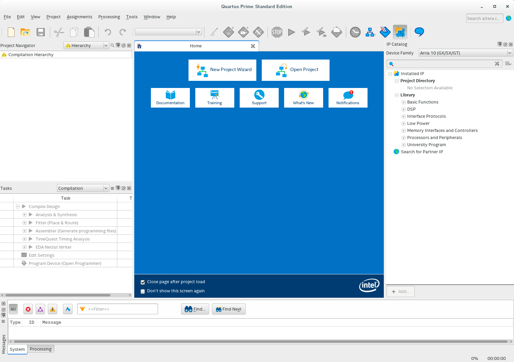

That was quite the process, I know. To summarize, we learned how to remotely interact with a Dell PowerEdge R720xd server using its built-in iDRAC controller, install CentOS 7 on the server with a GNOME Desktop environment, install VNC server and client software on the server and macbook respectively, install the Altera EDA tools (Quartus Prime Standard Edition, ModelSim-Intel FPGA Edition) we'll be using with the Arria 10 SoC Development Kit, and acquire and serve a license for the features we need. With our board selected and hardware development environment set up, we're now ready to begin designing the hardware-accelerated system!

### 3. Understand the software you wish to accelerate

*This is perhaps the most important step.* Time spent here will directly impact your approach to the problem, the design of your hardware accelerator, and ultimately your success in imporving system performance. A philosophy I adhere to is that one's understanding of how something works is directly proportional to that individual's ability to debug issues or improve upon its design. When you're attempting to replace components of a large software project with specialized hardware, this is especially true. The goal of this step is to fundamentally understand **the movement of and operations on data**. This will help you identify *performance bottlenecks* in the software. Is the system *memory bandwidth-limited*? Is it *computation-limited*? Answering these questions provides insight into what can be tuned to improve performance.

When working with someone else's software, extra time is needed to *understand how the code is structured* and to *identify source files, data structures, functions, etc.* that are relevant to the computation you wish to accelerate. This was my case in choosing to work with <a href="https://developers.google.com/protocol-buffers/">Protocol Buffers</a> and focusing specifically on *Protocol Buffer serialization*. I had no prior experience using the software nor was I familiar with <a href="https://developers.google.com/protocol-buffers/docs/encoding">varint encoding</a> (a mechanism used heavily in the serialization code). The obvious first step was to acquire a basic understanding of how Protocol Buffers are used in applications; I achieved this by going through the online documentation, building and installing the software, and running the example applications provided. After that, I was ready to dig deeper for an understanding of how the *Protocol Buffer serialization* code works.

There are powerful tools available that one can use to navigate the source code of a software project and inspect running applications; using these tools helped me identify the source code responsible for *Protocol Buffer serialization* and understand it to a level at which I was able to begin designing the hardware that would eventually replace it. One such tool is the marriage of <a href="http://www.vim.org/">vim</a> and <a href="http://ctags.sourceforge.net/">ctags</a>. I used this combination to review a Protocol Buffer application line-by-line and jump to the source files containing definitions of class methods as they were invoked. This helped me better understand the relationship between the *compiler-generated code* and *runtime library* that are components of any Protocol Buffer application. I then used the <a href="https://www.gnu.org/software/gdb/">GNU Debugger</a> (`gdb`) to step through the same application and inspect <a href="https://en.wikipedia.org/wiki/Stack_trace">stack traces</a> as it actively serialized a Protocol Buffer <a href="https://developers.google.com/protocol-buffers/docs/reference/cpp/google.protobuf.message#Message">Message</a>. This helped me understand the sequence (and frequency) of method invocations involved in the serialization. The last tool I'll mention is <a href="https://perf.wiki.kernel.org/index.php/Main_Page">perf</a> - a powerful <a href="https://en.wikipedia.org/wiki/Profiling_(computer_programming)">profiling</a> tool used in <a href="https://en.wikipedia.org/wiki/Performance_tuning">performance tuning</a>. `perf` makes use of <a href="https://en.wikipedia.org/wiki/Hardware_performance_counter">performance counters</a>, kernel <a href="https://www.kernel.org/doc/Documentation/trace/tracepoints.txt">tracepoints</a>, and even <a href="http://www.brendangregg.com/perf.html#USDT">user-level statically defined tracing (USDT)</a> to periodically sample a running application and provide detailed reports on where it spends its time (i.e., the various code paths taken and what percentage of the total execution time they account for). As demonstrated in section [9. Profiling the hardware-accelerated system](README.md#9-profiling-the-hardware-accelerated-system), we'll use it to profile applications running on both, standard (purely CPU/software model) and hardware-accelerated systems and analyze differences in their execution on the two systems.
    
In the remainder of this section, I'll provide an overview of the Protocol Buffer software, walk through an example of serializing a message, specify which version of the Protocol Buffer software we use in Firework (and show how to build it from source), demonstrate how I used `vim`+`ctags` and `gdb` to identify and understand the source code relevant to *Protocol Buffer serialization*, and discuss how time spent analyzing the `WireFormatLite` and <a href="https://developers.google.com/protocol-buffers/docs/reference/cpp/google.protobuf.io.coded_stream#CodedOutputStream">`CodedOutputStream`</a> classes and their relation to the various message <a href="https://developers.google.com/protocol-buffers/docs/proto3#scalar">field types</a> led to a key realization and simplifcation of the hardware accelerator design. I'll conclude this section with a brief discussion about importance of using `perf` at this stage as well, a lesson I learned after-the-fact.

#### Overview of Protocol Buffers and message serialization

From the <a href="https://developers.google.com/protocol-buffers/docs/overview">Developer Guide</a>, "Protocol buffers are a flexible, efficient, automated mechanism for *serializing structured data*". In the land of Protocol Buffers, structured data (or data structures) are called **messages**. Messages consist of a series of key-value pairs called **fields**, similar to <a href="http://www.json.org/">JSON objects</a>. Fields can be basic types (e.g., integers, booleans, strings), arrays, or even other embedded messages. The general idea is that you define the messages you want to use in your application in a `.proto` file and use the Protocol Buffer *compiler* (`protoc`) to generate specialized code that implements these messages in the language of your choice (e.g., C++ classes). The compiler-generated code provides accessors for individual fields along with methods that work closely with the Protocol Buffer *runtime library* (`libprotobuf.so.10.0.0`) to serialize/parse entire messages to/from streams or storage containers. Protocol Buffers are *extensible* in the sense that you can add new fields to messages without disrupting existing applications that use older formats; this is achieved by marking fields as `optional` rather than `required`.

For a more complete understanding of what Protocol Buffers are and how they're used, and to learn about **varint encoding** and how messages are serialized, I recommend going through the following material (which also serves as a prerequisite for the remaining content in this section and subsequent sections in this tutorial):
- <a href="https://developers.google.com/protocol-buffers/">Protocol Buffers</a>: Protocol Buffer home page
- <a href="https://developers.google.com/protocol-buffers/docs/overview">Developer Guide</a>: a good introduction
- <a href="https://developers.google.com/protocol-buffers/docs/cpptutorial">Protocol Buffer Basics: C++ </a>: tutorial on using Protocol Buffers in C++ (language used in Firework)
- <a href="https://developers.google.com/protocol-buffers/docs/encoding">Encoding</a>: describes varint encoding and message serialization

From the <a href="https://developers.google.com/protocol-buffers/docs/encoding">Encoding</a> page, we learned that field keys are actually composed of two values - a **field number** (or **tag**) and a **wire type** - when the containing message is serialized into its *binary wire format*. Field numbers are simply the integers assigned to the fields of a message as defined in the `.proto` file, and wire types, also an integer value, are determined by the type of a field's value (e.g., `int32`, `fixed64`, `string`, `embedded message`). Wire types provide information that's needed to determine the size, in bytes, of a field's encoded value following the key.

To serialize a message, its fields are encoded and written sequentially in ascending field number. A field is written with its encoded key first followed by its encoded value. Finally, keys are encoded as *varints* with the value: `(field number << 3) | wire type`, and the way a field's value is encoded depends on its wire type. To better understand how messages are serialized, let's walk through an example below.

Using the address book example application from the <a href="https://developers.google.com/protocol-buffers/docs/cpptutorial">C++ tutorial</a>, let's serialize, by hand, an `AddressBook` message that contains one `Person` message. Our `Person` message has the following fields:

```
name:       Kevin Durant
id:         35
email:      kd@warriors.com
phones:
    number: 4155551988
    type:   MOBILE
```

First up, we encode the `AddressBook` message's only field:

```
repeated Person people = 1;
```

We see that its field number is **1**, and referring to the table in the *Message Structure* section of the <a href="https://developers.google.com/protocol-buffers/docs/encoding">Encoding</a> page, its wire type is **2** (length-delimited) since the value's type is an embedded message (i.e., a `Person`). With this information, we're now ready to generate the value of the field's key and subsequently encode it as a varint. Left shifting the field number three times gives us `0b00001000`, and `OR`ing this value with the wire type produces the key's value of `0b00001010` (or `0a` in hex, `10` in decimal). Varint encoding this value next will give us our encoded key, the first data to be written when serializing our message.

Recall that base 128 varints use the <a href="https://en.wikipedia.org/wiki/Most_significant_bit">MSB</a> of each byte to indicate whether it's the final byte of data; this means the largest value a single byte of varint data can represent is **127** (i.e., `0b01111111` for the final byte and `0b11111111` for any other byte). With this in mind, the varint encoding algorithm can be described as follows (note, negative integers are treated as very large positive numbers):

*Is the value of this integer less than 128? If yes, append a `0b0` to the least significant 7 bits, and this produces the final byte of data. Otherwise, append a `0b1` to the least significant 7 bits, and this produces the next byte of data. Right shift the integer 7 times and repeat from the beginning.*

Turning back to our example, since the value of our key (**10**) is less than **128**, we append a `0b0` to the least significant 7 bits giving us our 1-byte varint encoded key, `0a` in hex. (Note, I'll use hex notation for all encoded data from this point forward.)

Next we encode the field's value, an embedded `Person` message. For length-delimited fields, encoded values consist of two parts: a varint encoded *length* followed by the specified number of *bytes of data*. The length in this case corresponds to the size of the encoded `Person` message. As I'll demonstrate later, the compiler-generated code provides methods for calculating and caching the sizes of populated messages as an optimization during serialization, so I'll just tell you that the `Person` message with the values above results in 47 bytes of encoded data. You can confirm this number after we've serialized all its fields. 

Since **47** is less than **128**, our varint encoded length is simply `2f`. The next 47 bytes of the length-delimited value consist of the encoded fields (keys and values) of the embedded `Person` message in ascending field number.

The first field of our `Person` message is:

```
required string name = 1;
```

The field number is **1** and wire type is **2** (length-delimited) since the value's type is a `string`. In the same way we arrived at our first varint encoded key, this field's varint encoded key is also `0a`.

The length we need to varint encode is simply the size of the string `Kevin Durant`, which is 12 bytes. Since **12** is less than **128**, our varint encoded length is `0c`. The second part of our length-delimited value consists of the 12 <a href="">UTF-8</a> encoded characters of the string `Kevin Durant`, which are `4b 65 76 69 6e 20 44 75 72 61 6e 74`. We now have our first completely encoded field! 

The next field of our `Person` message is:

```
required int32 id = 2;
```

This time our field number is **2** and wire type is **0** (varint) since the value's type is an `int32`. Following the same procedure, our varint encoded key is `10`.

The value of an `int32` field is also varint encoded. Since **35** less than **128**, our varint encoded value is `23` (and as fate would have it, Kevin Durant's number in hex matches that of Michael Jordan's in decimal).

The third field of our `Person` message is:

```
optional string email = 3;
```

The field number is **3** and wire type is **2** (length-delimited) giving us a varint encoded key of `1a`. (Hopefully at this point you've recognized that integers 0-127 result in 1-byte varints.) The string `kd@warriors.com` has 15 characters giving us a varint encoded length of `0f`, and following this are the UTF-8 encoded characters `6b 64 40 77 61 72 72 69 6f 72 73 2e 63 6f 6d`.

The fourth and final field of our `Person` message is also an embedded message:

```
repeated PhoneNumber phones = 4;
```

The field number is **4** and wire type is **2** (length-delimited) giving us a vaint encoded key of `22`.

The size of this embedded message is 12 bytes which gives us a varint encoded length of `0c`, but this isn't so obvoius. Jumping into the `PhoneNumber` message, as usual we encode its first field:

```
required string number = 1;
```

The field number is **1** and wire type is **2** giving us a varint encoded key of `0a`. The phone number `4155551988` has 10 characters giving us a varint encoded length of `0a`, and this is followed by the UTF-8 encoded characters `34 31 35 35 35 35 31 39 38 38` (don't confuse the phone number for a number, remember it's a string). But wait a minute... encoding the first field already gives us 12 bytes which I claimed was the size of the entire embedded `PhoneNumber` message. What about its second field:

```
optional PhoneType type = 2 [default = HOME];
```

Since this field is marked as `optional` and has `HOME` specified as the default value of `type`, it means that a serialized `PhoneNumber` message missing this field is assumed to have a `PhoneType` value of `HOME`. In other words, we don't have to include this field and a parser would still be able to reconstruct this message's corresponding C++ object, even if `type` was explicitly set as `HOME`. This field would have to be included if `type` was assigned a value other than the default (i.e., `MOBILE` or `WORK`).

With that said, we've finished serializing the embedded `PhoneNumber` message which means we've also finished serializing the embedded `Person` message which means we've also also finished serializing our `AddressBook` message! To summarize, the following bytes of data comprise the entire serialized `AddressBook` message:

```
0a 2f 0a 0c 4b 65 76 69 6e 20 44 75 72 61 6e 74 10 23 1a 0f 6b 64 40 77 61 72 72 69 6f 72 73 2e 63 6f 6d 22 0c 0a 0a 34 31 35 35 35 35 31 39 38 38
```

#### Building the Protocol Buffer compiler and runtime libraries from source, running the example C++ applications

Now that we're familiar with how Protocol Buffers are used and understand how messages are serialized, let's build the software from source and run the example applications provided. As an overview, we're going to clone the <a href="https://github.com/google/protobuf">google/protobuf</a> repository, see which versions of the software are available, create a new branch corresponding to release `v3.0.2` of the Protocol Buffers software, and finally, build it from source. `v3.0.2` was the latest version available at the time I worked on Firework and hence the version I forked and modified for use in the hardware-accelerated system. (The modified protobuf repository is located here: [firework/protobuf](protobuf).) We'll use both, the modified and unmodified protobuf libraries later to profile the *hardware-accelerated* and *standard* systems, respectfully. Note, I performed the following steps on the CentOS 7 server.

1. Download the Protocol Buffer source code repository found <a href="https://github.com/google/protobuf">here</a>.

```
git clone https://github.com/google/protobuf.git
```

2. Using `git tag`, let's list the tags included in the `protobuf` repository we just downloaded. These tags correspond to different releases of the software. Since we're interested in release `v3.0.2`, we'll create and checkout a new branch corresponding to the tag `v3.0.2`, all in one command.

```
cd protobuf
git tag
git checkout -b protobuf-v3.0.2 v3.0.2
git branch -v
```

Inspecting the output of `git branch -v`, we see that we've indeed switched to the new branch. The output should look something like this: 

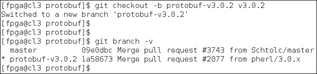

3. Follow the <a href="https://github.com/google/protobuf/blob/master/src/README.md">C++ Installation - Unix</a> instructions to build and install the Protocol Buffer compiler (`protoc`) and runtime libraries from source. Stop when you reach the *Compiling dependent packages* section. Here are some helpful notes on building:

- To install the build tools in the first step, replace `apt-get` with `yum` since we're using CentOS and not Ubuntu. There is no `g++` package in the CentOS repositories; the package you're insterested in is `gcc-c++` (which I think is more appropriately named). We should already have these tools installed since we selected *Development Tools* when installing CentOS, but it doesn't hurt to run this command anyway in case any tools are missing or there are updates
- Figure out how many threads your server can execute in parallel and use the `-j <num>` <a href="https://www.gnu.org/software/make/manual/html_node/Parallel.html">option</a> when running `make` for a faster build (e.g., `make -j 32` for me)
- Here's the output you want to see after running `make -j <num> check`:

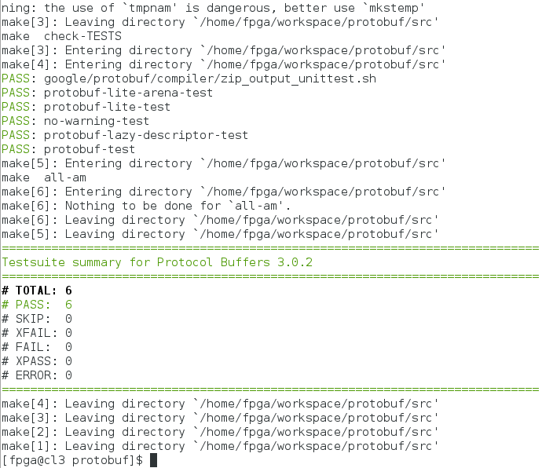

- Running `sudo make install`, places `protoc` in `/usr/local/bin/` and the runtime libraries in `/usr/local/lib/`:

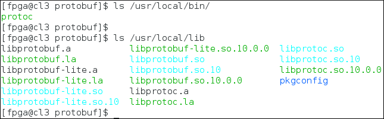

4. Now that we have the Protocol Buffer compiler and runtime libraries built and installed, let's use them to compile and run the C++ example applications, `add_person.cc` and `list_people.cc`. First we have to use `protoc` to generate C++ classes for the messages defined in `addressbook.proto`. Following the instructions from the section *Compiling Your Protocol Buffers* in the <a href="https://developers.google.com/protocol-buffers/docs/cpptutorial">Protocol Buffer Basics: C++</a> tutorial:

```
cd ~/workspace/protobuf/examples
protoc -I=./ --cpp_out=./ addressbook.proto
```

This generates two new files, `addressbook.pb.h` and `addressbook.pb.cc`:

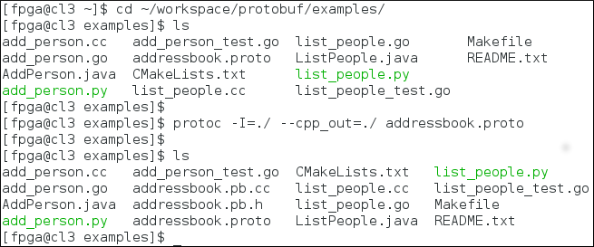

5. Now we have all the necessary components for compiling the C++ applications: the Protocol Buffer runtime libraries (e.g., `libprotobuf.so.10.0.0`), the compiler-generated C++ class definitions for the messages `AddressBook`, `Person`, and `PhoneNumber` used in our applications, and of course the applications themselves: `add_person.cc`, `list_people.cc`. Resuming where we left off in the <a href="https://github.com/google/protobuf/blob/master/src/README.md">C++ Installation - Unix</a> guide, the section *Compiling dependent packages* shows how to use `pkg-config` to compile and link applications against a package called `protobuf`. First, we need to tell `pkg-config` where it can find the file `protobuf.pc`:

```
pkg-config --cflags --libs protobuf
ls /usr/local/lib/pkgconfig/
export PKG_CONFIG_PATH=/usr/local/lib/pkgconfig/
pkg-config --cflags --libs protobuf
```

The sequence above shows how `pkg-config` fails to find the `protobuf` package at first and what you need to do to fix it. The second time  `pkg-config --cflags --libs protobuf` is run, we see the compiler and linker flags used for building any protobuf application: 

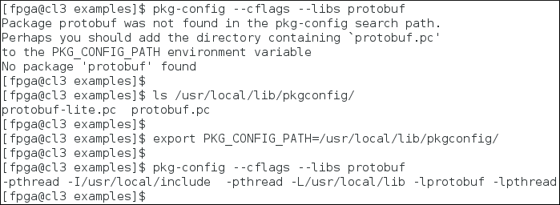

6. Finally, let's build the C++ example applications.

```
g++ add_person.cc addressbook.pb.cc `pkg-config --cflags --libs protobuf` -o add_person
g++ list_people.cc addressbook.pb.cc `pkg-config --cflags --libs protobuf` -o list_people
```
Your `protobuf/examples` directory should now contain two new binaries, `add_person` and `list_people`.

7. Let's run `add_person` to create a new `Person`, add it to a new `AddressBook`, and serialize and store the entire `AddressBook` message in a file called `my_addressbook`.

```
./add_person my_addressbook
```

Uh-oh! You probably received the following error message:

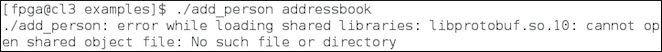

This error message means the <a href="https://en.wikipedia.org/wiki/Dynamic_linker">program loader</a> (`ld-linux-x86-64.so.2` on my system) was unable to find the runtime library (i.e., <a href="https://en.wikipedia.org/wiki/Library_(computing)#Shared_libraries">shared object</a> file) called `libprotobuf.so.10` that `add_person` needs to run. To solve this problem, we need to set the `LD_LIBRARY_PATH` environment variable with the path containing `libprotobuf.so.10`:

```
echo $LD_LIBRARY_PATH
export LD_LIBRARY_PATH=/usr/local/lib
echo $LD_LIBRARY_PATH
```

Now we should be able to run our application error-free. Run `./add_person my_addressbook` once more and follow the prompts to create a `Person` with the following fields:

```
name:       Kevin Durant
id:         35
email:      kd@warriors.com
phones:
    number: 4155551988
    type:   MOBILE
```

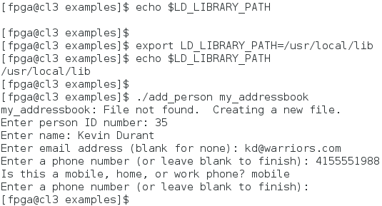

If you're unfamiliar with `LD_LIBRARY_PATH`; the difference between `ld` (the poorly-named <a href="https://en.wikipedia.org/wiki/Linker_(computing)">linker</a>) and `/lib/ld-linux.so.2` (the program loader); the directories `/lib`, `/usr/lib`, and `/usr/local/lib`; and/or the difference between files named `libprotobuf.so`, `libprotobuf.so.10`, and `libprotobuf.so.10.0.0` then I HIGHLY RECOMMEND you read <a href="http://tldp.org/HOWTO/Program-Library-HOWTO/shared-libraries.html">this page on shared libraries</a> through section *3.3.2. LD_DEBUG* before continuing.

8. Now let's run `list_people` to parse the serialized `AddressBook` message contained in the file `my_addressbook` and list its contents. 

```
./list_people my_addressbook
```

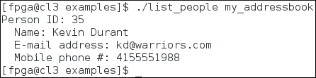

Great! We see the `Person` message we just created in the last step. Actually, this isn't that exciting. We can do better. Let's use the <a href="https://www.freebsd.org/cgi/man.cgi?query=hexdump&sektion=1">hexdump</a> utility to inspect the contents of `my_addressbook`, which contains the serialized `AddressBook` message (i.e., binary data):

```
hexdump -C my_addressbook
```

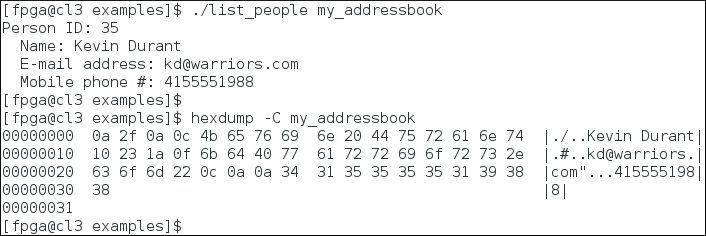

Lo and behold, we see 49 bytes of data, starting with `0a` and ending in `38`. If you compare this byte-for-byte with the `AddressBook` message we serialized earlier, you'll see they match. Incredible! Now that we're confident in our abilities to compile and run Protocol Buffer applications and serialize Protocol Buffer messages, let's see *how* the Protocol Buffer runtime library and compiler-generated code work together to perform serialization.

#### Stepping through add_person.cc: `vim` + `ctags`

In this section, we'll use `vim` and `ctags` to take a closer look at `add_person.cc` and dive into the code responsible for *Protocol Buffer serialization*. If you've never used it before, <a href="http://ctags.sourceforge.net/">ctags</a> is the holy grail of navigating large software projects that contain several source files. Used in conjunction with <a href="http://www.vim.org/">vim</a>, this creates a powerful, GUI-free method of understanding how an application's source code is structured. This is particularly useful when working with embedded systems or accessing a remote computer via `ssh` where a terminal may be your only interface (i.e., you can't use more powerful <a href="https://en.wikipedia.org/wiki/Integrated_development_environment">IDEs</a> like <a href="https://www.eclipse.org/">Eclipse</a>, <a href="https://atom.io/">Atom</a>, etc.).

If you've never used `vim` before, take some time to become familiar with the keyboard commands. In fact, a keyboard is your only way of interacting with `vim`. Find a tutorial that covers the various modes of operation and basic navigation; perhaps <a href="https://www.howtoforge.com/vim-basics">this</a> is a good starting point. Once you've got the basics down, here's the <a href="https://courses.cs.washington.edu/courses/cse451/10au/tutorials/tutorial_ctags.html">tutorial</a> I used to learn how to use `ctags` with `vim`. It may be difficult to internalize all the relevant commands in such little time; a useful thing to do is to make your own cheat sheet of commands frequently used or that you're trying to learn and keep it somewhere accessible. I placed Post-it notes on my monitor for basic `vim` navigation and `ctags`-specific commands:

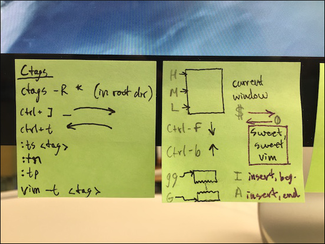

Off the top of my head, here are some other fundamental commands you'll find yourself using:

Command | What it does
:--- | :--- 
`i` | enters insert mode (i.e., you can begin editing the file. Hit `ESC` to exit this or any other mode)
`u` | undo
`ctrl + r` | redo
`dd` | deletes a line
`p` | paste whatever's stored in `vim`'s buffer (try `dd p` and see what happens)
`:w` | save
`:wq` | save and quit
`:set nu` | displays line numbers
`:set nonu` | hides line numbers
`/ <reg_exp>` | search the file for every instance of `<reg_exp>`
`n` | jump to the next match of `<reg_exp>`
`? <reg_exp>` | search the file for every instance of `<reg_exp>`
`n` | jump to the previous match of `<reg_exp>` :)
`:f` | display the file that's currently open
`:sp <file>` | opens `<file>` and splits the window (note, only one file is in focus at a time)
`ctrl + w`, `ctrl + w` | toggles focus between split windows
`ctrl + w`, `up arrow` | switches context to the window above the one currently in focus
`ctrl + w`, `down arrow` | I think you're smart enough to infer its function
`:q` | quit (exit's the split window in focus or all of `vim` if only one file is open)

Without further ado, let's dive into `add_person.cc` and learn how messages are serialized.

1. In the `protobuf/src` directory (i.e., the root directory containing the Protocol Buffer runtime library's source code), let's use `ctags` to generate an index of all <a href="http://en.cppreference.com/w/cpp/language/identifiers">identifiers</a> used in the source code. This creates a new `tags` file which maps identifiers to their containing source file(s). Note, we should still be on branch `protobuf-v3.0.2`.

```
cd ~/workspace/protobuf/src
ctags -R *
``` 

2. From the same directory, open `add_person.cc` with `vim`:

```
vim ../examples/add_person.cc
```

Note that if you switch to another directory (e.g., `protobuf/examples`) and open `add_person.cc`, the tag-search commands we're going to use wouldn't work. You need to open a file with `vim` or invoke `vim -t <tag>` from the directory containing the `tags` file.

3. You should already be familiar with what `add_person.cc` does and how it's used. If not, revisit the <a href="https://developers.google.com/protocol-buffers/docs/cpptutorial">Protocol Buffer Basics: C++</a> tutorial. We want to focus on the code that's involved in serializing messages. Fortunately, there's only one line in the entire program that we care about: **line 85**. Navigate to this line and place your cursor anywhere over the identifier `SerializeToOstream()`, not `address_book` or `(&output)`. Note, I use the notation `FooBar()` to refer to functions or methods, purposely excluding any parameter list to avoid clutter. (Pro tip: try entering the command `:85` in `vim`.)

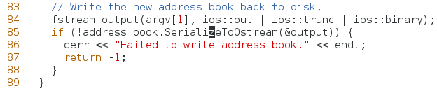

4. With the cursor over `SerializeToOstream()`, enter the command `ctrl + ]` to jump to its definition. This takes us to **line 175** of the file, `google/protobuf/message.cc`:

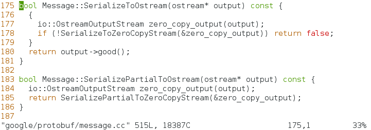

This marks our first use of `ctags`, and we immediately learn a few things:
- `SerializeToOstream()` is a method of the `Message` class, not `AddressBook` (i.e., the <a href="http://www.cplusplus.com/doc/tutorial/inheritance/">base class</a> that `AddressBook` is derived from and whose accessible members it inherits)
- Because `SerializeToOstream()` belongs to `Message`, we're looking at code that constitutes the *Protocol Buffer runtime library*, not *compiler-generated code*
- `SerializeToOstream()` is simply a wrapper function around `SerializeToZeroCopyStream()`, which we'll jump to next

5. Place the cursor anywhere over `SerializeToZeroCopyStream()` on **line 178**, and enter `ctrl + ]` once more. This takes us to **line 272** of the file, `google/protobuf/message_lite.cc`:

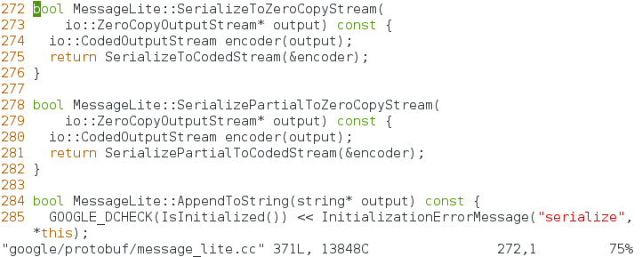

Alright, things are starting to get interesting. We see that `SerializeToZeroCopyStream()` is a method of the `MessageLite` class - the base class that `Message` is derived from (as seen <a href="https://developers.google.com/protocol-buffers/docs/reference/cpp/google.protobuf.message#Message">here</a> in the C++ API). This method instantiates a `CodedOutputStream` object and in turn calls `SerializeToCodedStream()`.

6. Place your cursor anywhere over `SerializeToCodedStream()` and enter `ctrl + ]`. This takes us to **line 234** of the same file. This method simply checks that the message object has been initialized (i.e., all required fields have been assigned values) and calls `SerializePartialToCodedStream()`. Place your cursor over this method and enter `ctrl + ]` once more. We see that it's defined right below starting on **line 239**:

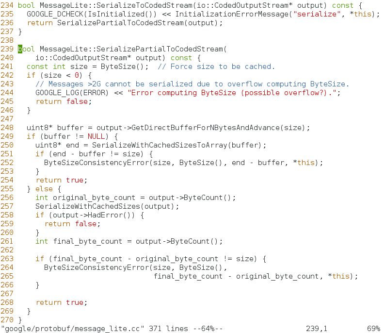

`SerializePartialToCodedStream()` is the first method with relevant content, and it's actually central to message serialization. It's in this method where the Protocol Buffer runtime library finally interacts with the compiler-generated code. As you may recall, I previously mentioned that the compiler-generated code provides methods for calculating and caching the sizes of populated messages as an optimization during serialization. Well, on **line 241** we call one such method, `ByteSize()`, of the `AddressBook` class. If you try jumping to `ByteSize()`'s definition with `ctrl + ]` like we've done so far, you'll see that `vim` + `ctags` yields several hundred options, and none of these options are actually useful. This makes sense since we only created an index (i.e., `tags` file) of the runtime library's source code, and I just said `ByteSize()` comes from the compiler-generated code. It took me quite some time to realize that not only does `ByteSize()` come from the compiler-generated code, it's also defined multiple times - once for each message in your `.proto` file. Since back in `add_person.cc` it was an `AddressBook` object that invoked `SerializeToOstream()`, it's `AddressBook::ByteSize()` that's invoked here which is defined on **line 1174** of the file, `protobuf/examples/addressbook.pb.cc`.

After the message object's size is cached, `SerializePartialToCodedStream()` then accesses the `CodedOutputStream` object's buffer, determines if it has enough room for the serialized message, and if so, calls `SerializeWithCachedSizesToArray()` to write the message to it directly. Otherwise, it calls `SerializeWithCachedSizes()` and passes it the entire `CodedOutputStream` object to write the message. Both methods perform the same function, but the former is optimized. Like `ByteSize()`, the methods `SerializeWithCachedSizesToArray()` and `SerializeWithCachedSizes()` also are part of the compiler-generated code and have multiple definitions, one for each message in the `.proto` file.

I'll demonstrate in the next section how `gdb` makes it very easy to identify the exact codepaths taken on each function or method invocation, fixing this deficiency of `vim` + `ctags`.

7. Let's step into `SerializeWithCachedSizesToArray()` to begin learning about the compiler-generated code's role in serializing messages. As mentioned, this method is defined once for each message; we'll look at the `Person` class's since it's more informative than the `AddressBook`'s and `PhoneNumber`'s definitions. For completeness, place your cursor over `SerializeWithCachedSizesToArray()` on **line 250** and enter `ctrl + ]`. This displays several options; enter `f` repeatedly until you've reached option `69`:

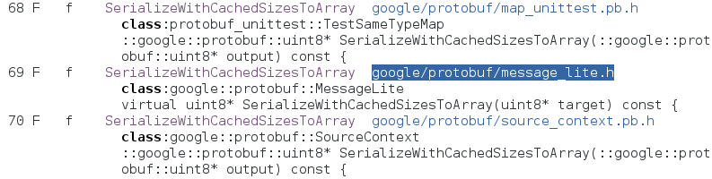

This is the source file we're interested in; it contains the definition of this member of the `MessageLite` class. Continue entering `f` until you've reached the bottom and are prompted to enter the number of the entry you wish to jump to:


Enter `69` and press `enter`. This takes us to **line 257** of the file, `google/protobuf/message_lite.h`: 

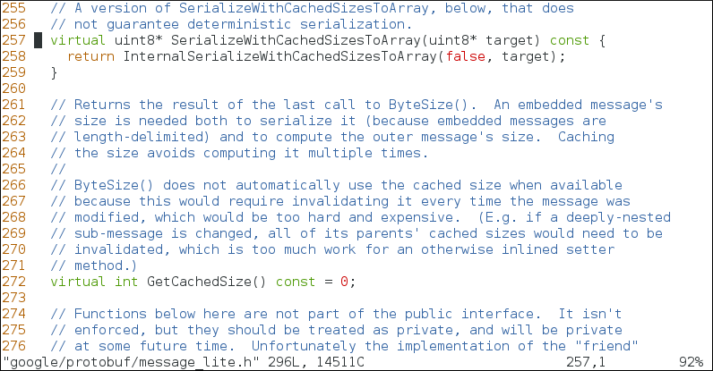

Ah-ha! Here we see that this method is a <a href="http://www.cplusplus.com/doc/tutorial/polymorphism/">virtual member</a> of the `MessageLite` class. This means derived classes can redefine this method, so hopefully now you believe me when I say this is where `AddressBook` and other compiler-generated message classes take over. Actually, if you look at the `Person` class's implementation of this method (**lines 198-200** of the file `addressbook.pb.h`), you'll see that it's identical to `MessageLite`'s and also calls `InternalSerializeWithCachedSizesToArray()`. We'll jump into `Person::InternalSerializeWithCachedSizesToArray()` next.

8. Enter `:q` to exit vim. Still in `~/workspace/protobuf/src`, open the file, `../examples/addressbook.pb.cc`. This is the source file that the compiler (i.e., `protoc`) spits out defining the three messages, `AddressBook`, `Person`, and `PhoneNumber`, and hence it's where we'll find `Person::InternalSerializeWithCachedSizesToArray()`.

9. Once open, let's display line numbers and search for the method.

```
:set nu
/ Person::InternalSerializeWithCachedSizesToArray
```

This brings us to the method's defintion on **line 677**:

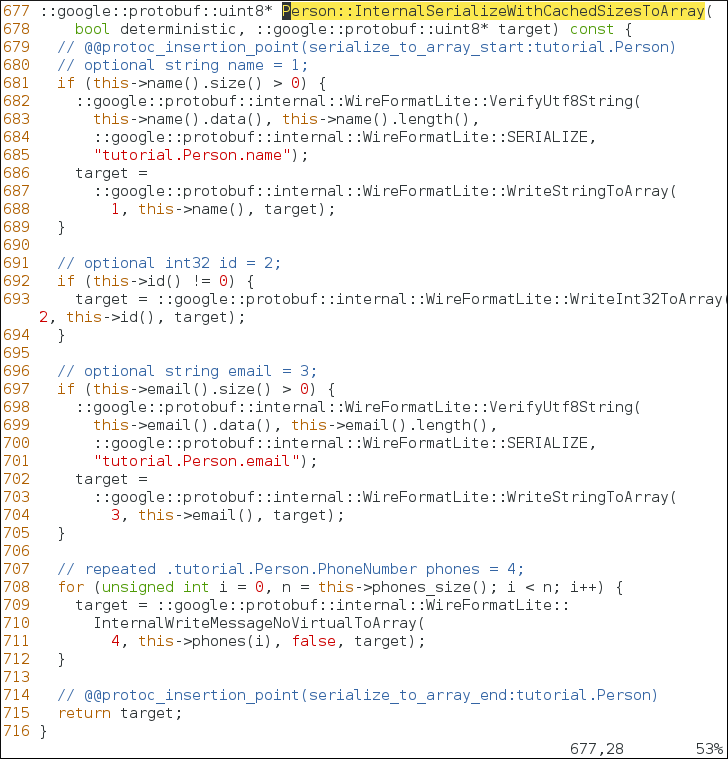

Don't let Google's extensive use of <a href="http://www.cplusplus.com/doc/oldtutorial/namespaces/">namespaces</a> and the <a href="https://docs.microsoft.com/en-us/cpp/cpp/scope-resolution-operator">scope resolution operator</a> frighten you; this method is actually very straightforward. Recall that the `Person` message has four fields as defined in the `.proto` file, copied below for convenience:

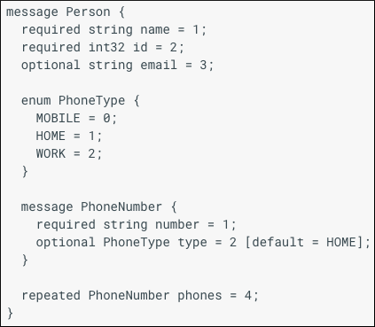

In the order of ascending field number, `Person::InternalSerializeWithCachedSizesToArray()`, calls a `WireFormatLite::Write*ToArray()` method for each field, where the particular `Write*ToArray()` method corresponds to the field value's type:
- `WireFormatLite::WriteStringToArray()` for `name`
- `WireFormatLite::WriteInt32ToArray()` for `id`
- `WireFormatLite::WriteStringToArray()` for `email`
- `WireFormatLite::InternalWriteMessageNoVirtualToArray()` for `phones`

`WireFormatLite` is a class that's internal to the Protocol Buffer runtime library, and its `Write*ToArray()` methods are used to serialize individual fields of a message and write them to an output buffer. As you can see, the compiler-generated code specifies *the order in which fields are written* and the runtime library *performs the actual writing*. Let's see how the `id` field is serialized by jumping into `WireFormatLite::WriteInt32ToArray()`.

10. Place your cursor over the identifier `WriteInt32ToArray()` and enter `ctrl + ]`. This takes us to **line 672** of the file, `google/protobuf/wire_format_lite_inl.h`: 

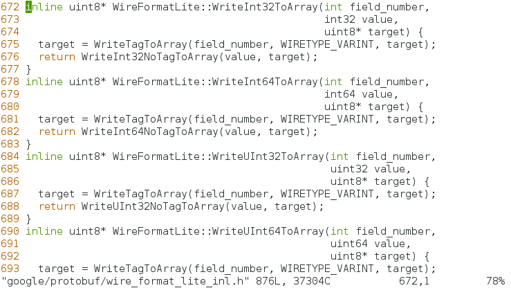

We see that this method calls two other `WireFormatLite` methods: `WriteTagToArray()` and `WriteInt32NoTagToArray()`. This should be intuitive now since we previously learned that a field is written key first followed by its encoded value (*key* and *tag* are synonyms). Let's look at `WriteInt32NoTagToArray()` next.

11. Place your cursor over the identifier `WriteInt32NoTagToArray()` and enter `ctrl + ]`. This takes us to **line 608** of the same file:

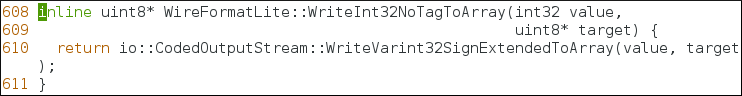

We see that this method is simply a wrapper function that calls the `CodedOutputStream` class's `WriteVarint32SignExtendedToArray()` method. From the <a href="https://developers.google.com/protocol-buffers/docs/reference/cpp/google.protobuf.io.coded_stream#CodedOutputStream">C++ API</a>, the `CodedOutputStream` class *"encodes and writes binary data which is composed of varint-encoded integers and fixed-width pieces"*. This sounds very promising; let's jump into `WriteVarint32SignExtendedToArray()` next. By the way, if we're comparing this call stack to the movie Inception, I think time is moving backwards at this point.

12. Place your cursor over the identifier `WriteVarint32SignExtendedToArray()` and enter `ctrl + ]`. This takes us to **line 1164** of the file, `google/protobuf/io/coded_stream.h`:

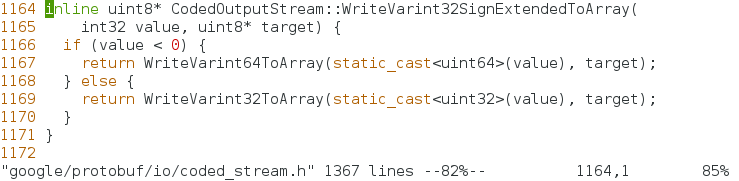

In this method, we see that the path taken next depends on the sign of the `int32` field's value. Let's take the <a href="http://popkey.co/m/rwmb7-red+pill-blue+pill-matrix">red pill</a> and venture down the `WriteVarint32ToArray()` rabbit hole. Proceed with caution; we may actually create a black hole in this next jump.

13. Place your cursor over the identifier `WriteVarint32ToArray()` and enter `ctrl + ]`. This takes us to **line 1145** of the same file:

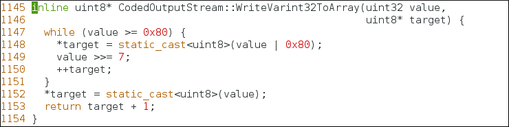

And with this my friend, I'm proud to say we've FINALLY reached what we've been (secretly) looking for: the code that actually performs varint encoding. Take some time to go through this method and confirm it implements the varint-encoding algorithm I described in English in the section, [Overview of Protocol Buffers and message serialization](README.md#overview-of-protocol-buffers-and-message-serialization).

To summarize, we've used `vim` and `ctags` to navigate our way through the Protocol Buffer runtime library and compiler-generated code, starting with an example application (`add_person.cc`) that initiates message serialization. We've learned that the runtime library and message classes defined in the compiler-generated code work hand-in-hand to encode and serialize individual fields, looking at how `int32` fields are varint encoded and serialized as an example. Although not explicitly stated, we've also learned that two classes central to serializing messages are `WireFormatLite` and `CodedOutputStream`, partially-defined in the files, `google/protobuf/wire_format_lite_inl.h` and `google/protobuf/io/coded_stream.h`, respectfully. I don't expect this next bit to be immediately intuitive, but it's actually quite significant that **all** message serialization and encoding logic is contained in these two classes (and really just the latter) and **not** in the compiler-generated code. I'll elaborate further on this in the section, [Analyzing the Protocol Buffer serialization code](README.md#analyzing-the-protocol-buffer-serialization-code).

I'm jumping ahead of myself, but it's `WriteVarint32ToArray()` and other methods of the `CodedOutputStream` class that we'll be modifying after we build the hardware accelerator, integrate it into the larger SoC system, and write a device driver that enables user space access to the newly developed FPGA peripheral. It's actually the device driver that creates an interface for the modifications we'll need to make!

Before we get there, let's see how using `gdb` to step through the same application and inspecting <a href="https://en.wikipedia.org/wiki/Stack_trace">stack traces</a> along the way provides a straightforward way of identifying relevant code paths and containing source files.

#### Stepping through add_person: `gdb`

In the last section, we used `vim` and `ctags` to navigate our way through `add_person.cc`, learning more about the soure code that's responsible for serializing messages. While this combo was very effective, it wasn't perfect. We were sometimes left with several hundred options to choose from in identifying the next codepath to take, and sometimes none of these paths were the one we needed. The <a href="https://www.gnu.org/software/gdb/">GNU Project Debugger</a> (a.k.a., the GNU Debugger, or simply `gdb`) fixes this problem, providing the ability to easily identify the exact codepaths taken and eliminating any guesswork. This powerful tool allows you to walk through an application as it executes, insert breakpoints, halt execution, inspect the values of variables, step into functions and methods as they're called, and inspect the <a href="https://en.wikipedia.org/wiki/Call_stack">call stack</a> among other things. While this tool's primary use is in debugging, it can also be effectively used to understand how a program works. In this section, we'll use `gdb` to walk through `add_person`, providing the same information for the `Person` message we previously serialized by hand, and make use of `gdb`'s <a href="https://sourceware.org/gdb/onlinedocs/gdb/Backtrace.html">backtrace</a> feature to take a closer look at the codepaths that ultimately lead to `WriteVarint32ToArray()` and other methods of the `CodedOutputStream` class.

If you've never used `gdb` before, here are some useful tutorials that cover everything from how to compile your program to include debugging information needed by `gdb`, to basic commands for the `gdb` command-line interface and retrieving information about call stack:
- <a href="http://web.eecs.umich.edu/~sugih/pointers/summary.html">GDB Tutorial</a>: a good intro, quick tutorial covering basics
- <a href="http://www.unknownroad.com/rtfm/gdbtut/">RMS's gdb Debugger Tutorial</a>: a more comprehensive tutorial (and the one I used to learn `gdb`)
- <a href="https://sourceware.org/gdb/onlinedocs/gdb/Backtrace.html">8.2 Backtraces</a>: using `gbd`'s backtrace feature to inspect the call stack

Once you're confident in your abilities to use `gdb`, continue below to step through `add_person`. Note, I'm using the CentOS 7 server with the Protocol Buffer runtime library already built and installed, as well as `add_person`. I also assume you didn't permanently set the `PKG_CONFIG_PATH` or `LD_LIBRARY_PATH` environment variables; you can safely skip these steps below if they're already set. Also note that we should still be on branch `protobuf-v3.0.2` of the `protobuf` respository.

1. `gdb` should already be installed on your machine, but just in case, run the following:

```
sudo yum install gdb
```

2. As you know, applications need to be compiled with the `-g` <a href="https://gcc.gnu.org/onlinedocs/gcc-3.0/gcc_3.html#SEC12">flag</a> in order for `gdb` to be able to step through them properly. This flag tells the compiler to include *debugging information* in the executable (or shared object file, as in the case of the Protocol Buffer runtime library, `libprotobuf.so.10.0.0`) it generates. Note that both `libprotobuf.so.10.0.0` and `add_person` are simply variants of an <a href="https://docs.oracle.com/cd/E19683-01/817-3677/chapter6-46512/index.html">object file</a>, and debugging information is added to these files in the form of additional `.debug_*` sections. Therefore, we can use the <a href="https://sourceware.org/binutils/docs/binutils/objdump.html">objdump</a> utility to list the sections contained in these files and look for the inclusion of `.debug_*` sections, confirming they were compiled with `-g`.

```
objdump -h /usr/local/lib/libprotobuf.so.10.0.0 | grep debug
```

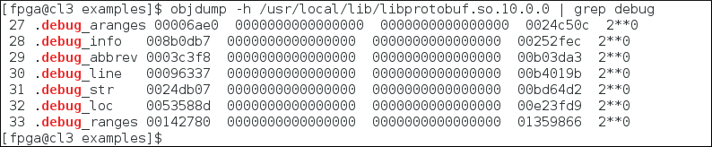

I used <a href="https://www.gnu.org/software/grep/manual/grep.html">`grep`</a> to filter the output, listing only lines that contain the string: `debug`. Here, we see that the Protocol Buffer runtime library was indeed compiled with `-g`. Now, let's check `add_person`.

```
cd ~/workspace/protobuf/examples
objdump -h add_person | grep debug
```


Uh-oh, we don't see any `.debug_*` sections in the output! That's ok, luckily it's an easy fix. Let's compile another version with debugging symbols and name it `add_person_dbg`.

```
export PKG_CONFIG_PATH=/usr/local/lib/pkgconfig
g++ add_person.cc addressbook.pb.cc `pkg-config --cflags --libs protobuf` -g -o add_person_dbg
objdump -h add_person_dbg | grep debug
```


... and we're all set! I encourage you to compare the size of the two binaries, `add_person` and `add_person_dbg`, using `ls -lh`. This should provide insight as to why production software is stripped of debugging symbols.

3. Now we're ready to invoke `gdb` and pass it `add_person_dbg` as the program we wish to "debug".

```
export LD_LIBRARY_PATH=/usr/local/lib
gdb add_person_dbg
run
```

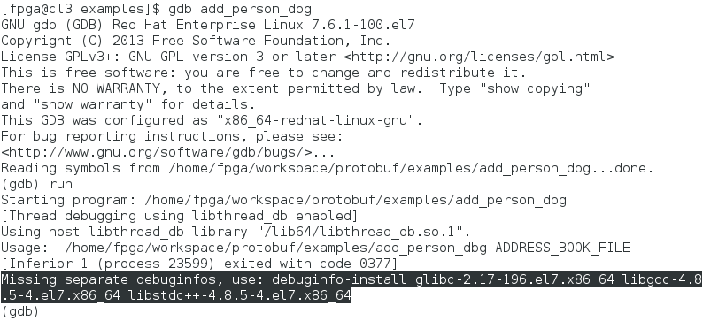

Since we didn't provide the name of an address book file, `add_person_dbg` prints a `Usage: ` statement and exits, as expected. If you look at `gdb`'s output following this statement (highlighted in the screenshot above), we see that we're missing debugging information for the <a href="https://www.gnu.org/software/libc/">GNU C Library</a> (`glibc`), <a href="https://gcc.gnu.org/onlinedocs/gccint/Libgcc.html">GCC low-level runtime library</a> (`libgcc`), and <a href="https://gcc.gnu.org/onlinedocs/libstdc++/faq.html#faq.what">GNU Standard C++ Library</a> (`libstdc++`), all of which `add_person_dbg` uses.

4. Let's exit the current `gdb` session and install these libraries' missing debugging symbols. Let's also remove `my_addressbook` (if it exists) such that the next invocation of `add_person_dbg` creates a new one that'll only contain the `Person` message we enter.

```
q
sudo debuginfo-install glibc libgcc libstdc++
rm my_addressbook
```

5. With debugging symbols for the executable, Protocol Buffer runtime library, and core libraries they use, we're now ready to step through `add_person_dbg`. Before we `run` the application under `gdb`, let's insert a breakpoint at **line 85** of `add_person.cc`. This is where `SerializeToOstream()` is called, and hence where the `AddressBook` message's serialization is initiated.

```
gdb add_person_dbg
break 85
run my_addressbook
```

Following the prompts, enter the information of our example `Person` message from before (see below). After the last field is entered, `gdb` will continue executing `add_person_dbg` and halt when it reaches the first instruction corresponding to **line 85** of the source file `add_person.cc`.


6. Run the `list` command without any arguments. This displays the 10 lines of code centered around where the program was halted (i.e., **line 85**). We already knew that we want to step into `SerializeToOstream()`, but `list` comes in handy when you've stepped into a function and need to figure out where to go next. Running `list` again displays the next 10 lines of code, and so on.

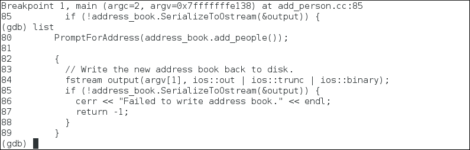

7. Run the `step` command to instruct `gdb` to step into `SerializeToOstream()`. This takes us to **line 175** of the file, `google/protobuf/message.cc`. Note that if we ran `next` instead, `gdb` would've executed the subroutine completely, returned, and halted execution at the instruction immediatedly following the call to `SerializeToOstream()`.

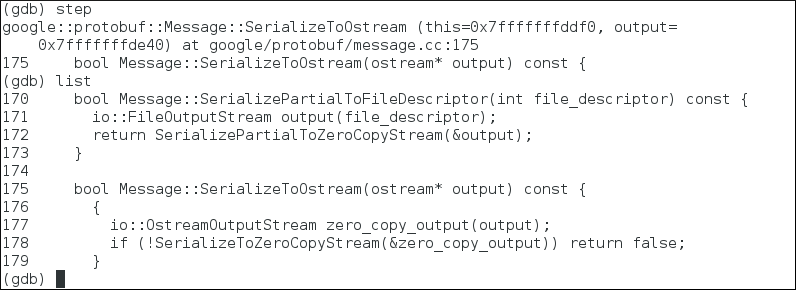

Inspecting the output of `list`, we see that `SerializeToZeroCopyStream()` is on **line 178**, and this is the method we want to jump into next. One way of getting there is to set another breakpoint at **line 178** and run the command, `continue`. 

8. Set a breakpoint at **line 178** and run the commands `continue`, `step`, and `list`. This takes us into the method `SerializeToZeroCopyStream()` at **line 273** of the file, `google/protobuf/message_lite.cc`.

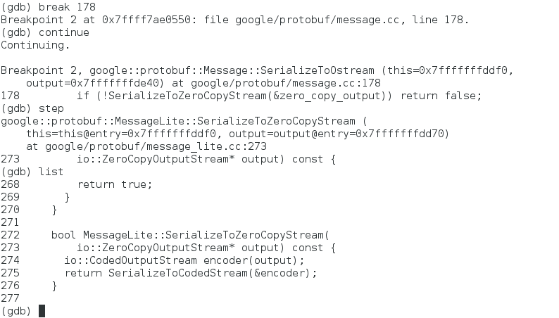

9. Next, we want to jump into `SerializeToCodedStream()` at **line 275**. Before we do this, however, let's run the command `backtrace` (or `bt`, or `info stack`) to see what our <a href="https://en.wikipedia.org/wiki/Call_stack">call stack</a> looks like at this point.

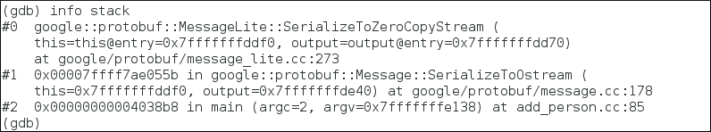

We see `SerializeToZeroCopyStream()` at the top of the stack (entry `#0`) which is currently the active <a href="http://www.cs.uwm.edu/classes/cs315/Bacon/Lecture/HTML/ch10s07.html">stack frame</a>. Underneath are stack frames for `SerializeToOstream()` of the `Message` class and `main()` of `add_person.cc`, neither of which have finished executing. Take some time to become familiar with reading the output of this command. It's `gdb`'s ability to step into functions and provide informative <a href="https://en.wikipedia.org/wiki/Stack_trace">stack traces</a> that allows us to eventually reach `CodedOutputStream::WriteVarint32ToArray()` without any guesswork. Let's continue on that journey!

10. Set a breakpoint at **line 275**, `continue` to this breakpoint, and `step` into `SerializeToCodedStream()`. This takes us to **line 236** of the same file. Repeating this pattern, continue stepping into the following methods (where each one is called somewhere in the body of the one prior):

- `MessageLite::SerializePartialToCodedStream()`
- `AddressBook::SerializeWithCachedSizesToArray()`
- `AddressBook::InternalSerializeWithCachedSizesToArray()`
- `WireFormatLite::InternalWriteMessageNoVirtualToArray()`
- `WireFormatLite::WriteTagToArray()`
- `CodedOutputStream::WriteTagToArray()`
- `CodedOutputStream::WriteVarint32ToArray()`

Once in `CodedOutputStream::WriteVarint32ToArray()`, set a breakpoint at **line 1147** (the first line of this method's body). This way, we can subsequently run `continue` to reach this method again, run a `backtrace`, and inspect the call stack to see which field's tag, length-delimited size, or value is actively being varint encoded.

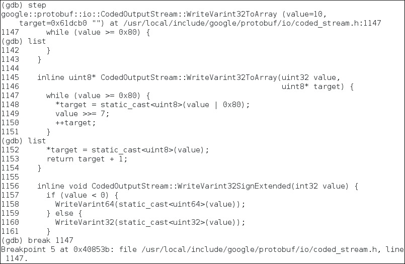

Note, **it is not trivial** to reach this point. It might take several tries for you to figure out when to `step`, when to run `next`, and when to `continue`, as some method invocations span several lines and call other methods themselves, using the return value as a parameter. If you've properly navigated your way to the *first time* `CodedOutputStream::WriteVarint32ToArray()` is called, running `bt` should result in the following call stack:

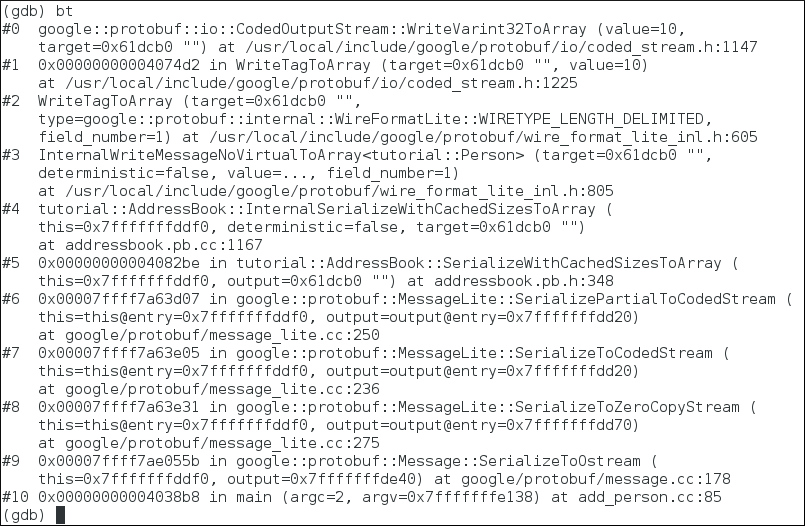

Let's take a look at what's happening at this point in the program's execution. Starting with `AddressBook::InternalSerializeWithCachedSizesToArray()` (`#4` in the call stack), this compiler-generated method calls the runtime library's `WireFormatLite::InternalWriteMessageNoVirtualToArray()` once for each embedded `Person` message it needs to serialize. This makes sense; recall that an `AddressBook` message only has one field, a `repeated Person people = 1;`. As for any field, first we encode and write this `embedded message` field's key. With a field number of **1** and wire type of **2** (length-delimited), the value we need to varint encode (giving us our key) is `10` in decimal. Correspondingly, `WireFormatLite::InternalWriteMessageNoVirtualToArray()` calls `WireFormatLite::WriteTagToArray()`, setting its parameters `type` and `field_number` to `WireFormatLite::WIRETYPE_LENGTH_DELIMITED` and `1`, respectfully. (Again, note that `Tag` in `WriteTagToArray()` is synonymous to my use of the word *key*; this method is for writing field keys.) This method in turn calls `CodedOutputStream::WriteTagToArray()`, setting its parameter `value` to `10`. Last, `CodedOutputStream::WriteTagToArray()` calls `CodedOutputStream::WriteVarint32ToArray()`, also setting its parameter `value` to `10`, which is where the number `10` is varint encoded into the hex value `0a`, finally producing our first byte of serialized data: the first varint encoded key of the first field of our `AddressBook` message. Cool, eh? :)

11. We expect the program to varint encode the *size* (in bytes) of the embedded `Person` message next, since it's a length-delimited field. Let's run `continue` to take us to the next invocation of `CodedOutputStream::WriteVarint32ToArray()`, and inspect the stack.

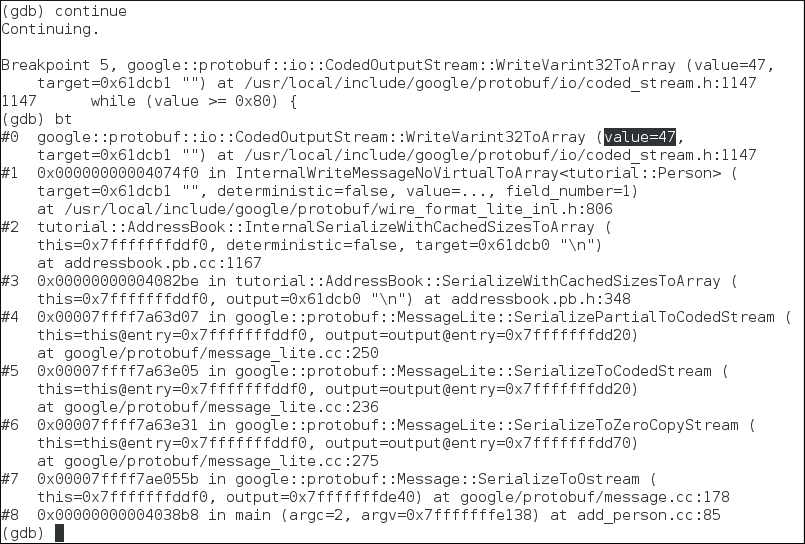

Highlighted above, we see that the number `47` is being varint encoded next; recall that this is the size of our example `Person` message.

12. Run `continue` followed by `bt` once more, and let's take a look at what the stack is telling us: 

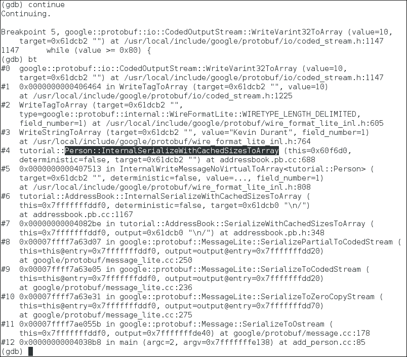

We see that `WireFormatLite::InternalWriteMessageNoVirtualToArray()` (`#5` in the call stack) calls `Person::InternalSerializeWithCachedSizesToArray()`, which is the compiler-generated method we analyzed in the last section and know is responsible for serializing the `Person` class's individual fields! This method calls `WireFormatLite::WriteStringToArray()` first, setting its parameters `value` and `field_number` to `"Kevin Durant"` and `1`, respectfully, to proceed with serializing the `Person` message's first field: `required string name = 1;`. As usual, we write this field's key first which leads to varint encoding the value `10` in `CodedOutputStream::WriteVarint32ToArray()`. Before we conclude this section, let's see which methods are responsible for serializing the value (`"Kevin Durant"`) of our `name` field.

13. Set a breakpoint at **line 736** of the file, `google/protobuf/io/coded_stream.cc`, run `continue`, and run `bt` one final time.

```
break coded_stream.cc:736
continue
bt
```

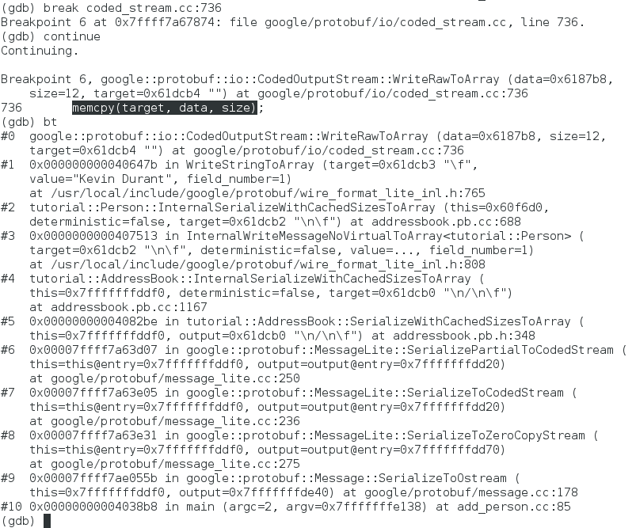

Here, we see that `WireFormatLite::WriteStringToArray()` (`#1` in the call stack) calls `CodedOutputStream::WriteRawToArray()`, setting its parameter `size` to `12`: the length of the string `"Kevin Durant"`. This method in turn calls <a href="http://man7.org/linux/man-pages/man3/memcpy.3.html">`memcpy()`</a> on **line 736** (highlighted above), instructing the system to copy 12 bytes of data from the memory area pointed to by `data` to the memory area pointed to by `target`. For those brave enough, let's jump into `memcpy()` next.

14. Run `step` and `list`.

.png)

Here we see that we've now entered code that belongs to the GNU C Library, `glibc`. We also see that `memcpy()` is implemented in <a href="https://en.wikipedia.org/wiki/X86_assembly_language">x86 assembly</a>. Details of this method's <a href="https://sourceware.org/git/?p=glibc.git;a=blob;f=sysdeps/x86_64/multiarch/memcpy-ssse3.S;h=9642ceecd90f35a918ed96981836c5a8cdf8f0fa;hb=HEAD">implementation</a> are beyond the scope of this tutorial, but the important takeaway is that this is where the Protocol Buffer runtime library hands off execution to the system for copying *raw bytes of data* from one memory location to another (i.e., to our output stream).

In the next section, we'll see how keys and values of all field types can be categorized into two high-level types of data: *varint data* and *raw data*.

#### Analyzing the Protocol Buffer serialization code

In the previous two sections, we saw that the compiler-generated code works very closely with the Protocol Buffer runtime library to serialize fields of a message. We took a closer look at `Person::InternalSerializeWithCachedSizesToArray()` and saw that it makes a sequence of calls to `WireFormatLite::Write*ToArray()` methods to serialize its fields in order of ascending field number. I like to call `InternalSerializeWithCachedSizesToArray()` the *"lowest high-level serialization method"*; its purpose is to provide the *order* in which fields of a message (e.g., a `Person` message) are encoded and written to an output buffer. Next, we looked at the `WireFormatLite::Write*ToArray()` methods that it calls and saw that they in turn call `CodedOutputStream::Write*ToArray()` methods which actually *perform the encoding and writing* of field keys and values. Finally, we learned that `CodedOutputStream::WriteVarint32ToArray()` is the method responsible for varint encoding 32-bit integers.

As it turns out, there are six methods of the `CodedOutputStream` class that contain all the logic for encoding and writing keys and values of **all field types**:

1. `WriteVarint32ToArray()`

.png)

2. `WriteVarint64ToArrayInline()`

.png)

3. `WriteLittleEndian32ToArray()`

.png)

4. `WriteLittleEndian64ToArray()`

.png)

5. `WriteRaw()`

.png)

6. `WriteRawToArray()`

.png)

This brings us to the first of two *key realizations* I had when analzying the code:

*1. All logic for serializing fields of any message is contained within the Protocol Buffer runtime library, **NOT** in the compiler-generated code*

This is significant because it means that we don't have *specialized encoding logic* in the compiler-generated code for messages defined in a `.proto` file but rather *a consistent mechanism for serializing fields*: calling one of the six `CodedOutputStream` methods above. It's these methods that serve as templates for designing the <a href="https://en.wikipedia.org/wiki/Datapath">datapath</a> of the hardware accelerator. They also shed light on how data would eventually be communicated from the SoC's ARM Cortex-A9 CPU to the hardware accelerator, leading to my choce of designing the peripheral as an <a href="https://github.com/att-innovate/firework/blob/master/resources/AMBA%20AXI%20and%20ACE%20Protocol%20Specification.pdf">ARM AMBA AXI4</a> slave peripheral. Had the logic been part of the compiler-generated code, it may have been much more difficult or not possible to design a single hardware accelerator that supports serialization of all Protocol Buffer applications.

The second key realization came from thinking about how all the supported field types map to these six methods:  

*2. Keys are encoded as varints, and values of all field types can be categorized as either **varints** or **raw data***

Let's look more closely at how the supported *field types* map to one of six *wire types* in the following table, pulled from the <a href="https://developers.google.com/protocol-buffers/docs/encoding">Encoding</a> page:

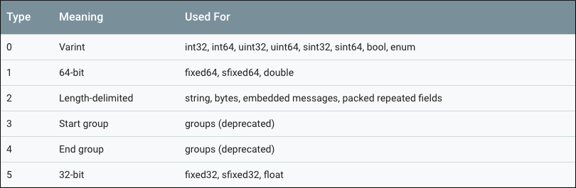

Note, I chose to omit support for wire types `3` and `4` from the hardware accelerator design because `groups` have been depreciated starting with the **proto3** version of the Protocol Buffers language, and we're working with version `v3.0.2`. 

Wire type `0` is used for field *keys*; the following field types (from the table): `int32`, `int64`, `uint32`, `uint64`, `sint32`, `sint64`, `bool`, `enum`; and the *size* of length-delimited fields. All of these are encoded as **varints**. 

Wire type `2` is used for length-delimited fields (`string`, `bytes`, `embedded messages`, `packed repeated fields`), and their values can be thought of as *variable-sized* **raw data** that simply needs to be copied byte-for-byte to an output buffer. Wire type `1` is used for 64-bit data (`fixed64`, `sfixed64`, `double`) whose payload is always *8 bytes*, and wire type `5` is used for 32-bit data (`fixed32`, `sfixed32`, `float`) whose payload is always *4 bytes*. Values of these two wire types are also copied byte-for-byte, so you can classify them as **raw data** as well.

This second insight that all serialized data could be classified into two broad categories led to a major simplificaiton and optimization in the hardware accelerator design: I could build a datapath that consists of two parallel channels for processing incoming **varints** and **raw data** and stitch together the encoded data into a unified output buffer, presesrving the order in which the fields are serialized. There isn't a precise way for me to explain how I came to this, and it's a prime example of how RTL design is an art. I took the time to fundamentally understand the *operations being performed on data* and *how the data is moving* at a level even lower than the abstraction provided above by the Protocol Buffer language.

I elaborate further on the hardware accelerator design and how it supports the various field types in the section, [Design and Implement the hardware accelerator (FPGA peripheral)](README.md#4-design-and-implement-the-hardware-accelerator-fpga-peripheral).

#### A brief note on `perf`

If I could go back, I would also use `perf` at this stage to learn more about the *frequency at which different methods are invoked* and the *percentage of total execution time* the various codepaths, focusing on those belonging to message serialization, account for. `perf` also yields important information on time spent in the *user space application* vs. *core libraries* and even time spent *executing <a href="https://github.com/torvalds/linux">kernel</a> code*. It may very well be the case that a considerable amount of the execution time is spent in areas you weren't aware of and hence didn't target for acceleration (e.g., the overhead of calling `memcpy()` in the `CodedOutputStream::Write*()` methods when serializing raw data). With this information, you can guage whether specialized hardware could even outperform the software, and if so, which codepaths you should target for optimization (i.e., design hardware to replace). It was a combination of lacking experience in analyzing system performance, thinking the <a href="https://static.googleusercontent.com/media/research.google.com/en//pubs/archive/44271.pdf">paper</a> provided sufficient motivation, and being overwhelmed with too many other unknowns in this project that led to me skip this step.

## Hardware Development

If you've made it this far, congratulations! Now that we have our board selected, our development environment set up with the necessary EDA tools installed, and understand how Protocol Buffer serialization (and the code that performs it) works, we're ready to begin designing our hardware accelerator. I claimed that the last section was *the most important step* of the process. Well, I think this section is *the most interesting step* as much of it relies on creativity. It took a lot of preparation to get to this point, and in the following sections, we'll finally be able to realize our vision.

First, let's see how the six `CodedOutputStream::Write*()` methods identified in the last section are translated into a hardware accelerator. Then, we'll integrate the newly developed FPGA peripheral into the larger <a href="https://rocketboards.org/foswiki/Documentation/GSRDGhrd">Arria 10 GHRD</a> system, serving as a co-processor to the ARM Cortex-A9 CPU on board.

### 4. Design and Implement the hardware accelerator (FPGA peripheral)

If you've worked with <a href="https://en.wikipedia.org/wiki/Field-programmable_gate_array">FPGAs</a> in the past, perhaps in the lab section of an introductory course on logic design, it's important to understand that building a hardware accelerator requires a slightly different train of thought. It's not a *standalone piece of hardware* that we're implementing in the FPGA (e.g., a simple counter whose input is connected to a push button and output is displayed via a 7-segment display); we're designing an FPGA peripheral that's just *one small component of a much larger, complicated digital system*. In this case, we're going to design a hardware accelerator that performs Protocol Buffer serialization and communicates with the ARM Cortex-A9 CPU on board which in turn executes the Protocol Buffer Linux application. The ARM CPU (master) initiates a sequence of write transactions sending data that needs to be serialized to the hardware accelerator (slave). The hardware accelerator processes the incoming data and stores serialized bytes in an output buffer ready to be accessed by the ARM CPU via subsequent read transactions. The FPGA peripheral I just described serves as a *co-processor* to the ARM CPU in this configuration. Actually, its top-level inputs and outputs are only connected to/accessed by the CPU! It may be troubling at frist to think you're going to build a very sophisticated digital circuit whose only means of interaction is via instructions executed on an ARM CPU (sorry, no <a href="https://en.wikipedia.org/wiki/DIP_switch">dip switches</a> or LEDs here!), but rest assured, I'll show you how to methodically approach the problem and make it seem less like a leap of faith (like it was for me).

How did I even come to realize this is how the hardware accelerator we're going to build fits into the larger SoC system? The answer is I went through an extensive amount of the online training available and made sure I understood the hardware, driver, and software examples provided until I finally had enough pieces of the puzzle figured out to know what I needed to do for my project. I had to become intimate with the general FPGA design process (from Intel's point of view), how Intel's EDA tools are used at the various stages (e.g., designing RTL, performing functional verification, building complete systems, etc.), the architecture of the <a href="https://rocketboards.org/foswiki/Documentation/GSRDGhrd">Arria 10 SoC GHRD</a> and specifically bridges between the Arria 10 SoC <a href="">hard processor system (HPS)</a> and FPGA for communication, writing drivers for memory mapped FPGA peripherals that use these bridges, understanding how Linux applications interact with hardware in the GHRD, and eventually the ARM AMBA AXI4 interface protocol I'd be using to define the hardware accelerator's top-level I/O ports and establish communication with ARM CPU.

First, let's look at the online training, examples, and other resources available that were necessary to reach the point of understanding how the hardware accelerator fits in to the larger Arria 10 SoC system. Then, I'll go over the RTL design in quite some detail, explaining how it implements an ARM AMBA AXI4 slave interface and is ready to communicate with an ARM CPU. Finally, we'll see how to use Intel's EDA tools to implement the hardware accelerator design and run gate-level simulations for functional verification. 

#### Training necessary to understand the design and fit of the FPGA peripheral in the Arria 10 GHRD system

As a prerequisite to understanding the hardware accelerator design in the following section, I'm assuming you have a background in or basic understanding of the principles of logic design and digital systems, combinational vs. sequential logic, controllers (<a href="https://en.wikipedia.org/wiki/Finite-state_machine">FSMs</a>), <a href="https://en.wikipedia.org/wiki/Datapath">datapaths</a>, <a href="https://en.wikipedia.org/wiki/Register-transfer_level">RTL design</a>, the use of <a href="https://en.wikipedia.org/wiki/Hardware_description_language">HDLs</a> to implement hardware at a behavioral level, the concept of <a href="https://en.wikipedia.org/wiki/Pipeline_(computing)">pipelining</a>, and designing custom processors. I've essentially listed material covered in the book, <a href="https://www.amazon.com/Digital-Design-RTL-VHDL-Verilog/dp/0470531088">Digital Design</a> by Frank Vahid, and I recommend reviewing this material before proceeding. If at any point you find yourself unfamiliar with a particular topic, you can refer to this book or other sources to learn more and continue with the tutorial.

Another vital source of information is the <a href="https://www.altera.com/support/training/curricula.html">Intel FPGA Technical Training</a>, which provides several free online courses on almost every aspect of building FPGA designs. I selected courses as I saw fit to review certain material, learn about how and when to use the various EDA tools (some I've used in the past, some were new to me), and ultimately to help me understand what I'd need to do in order to build a hardware accelerator using an Arria 10 SoC Development Kit as the platform of choice. There's one class in particular that was the final piece to the puzzle; it provided the last bit of information I needed to finally understand how an FPGA peripheral would eventually integrate into the larger Arria 10 SoC system. Take some time to go through the list of courses available to get a feel for the different aspects of building FPGA designs. Listed below are the courses I recommend covering in that order, ommitting the last course I mentioned which I'll provide at the end of this section after I've discussed other necessary sources of online training.

**Recommended Intel FPGA and other online training:** 

(*Optional*) Background information on programmable logic and FPGAs
- <a href="https://www.altera.com/support/training/course/odsw1005.html">Basics of Programmable Logic: History of Digital Logic Design</a>
- <a href="https://www.altera.com/support/training/course/odsw1006.html">Basics of Programmable Logic: FPGA Architecture</a>
- <a href="https://www.altera.com/support/training/course/odsw1010.html">How to Begin a Simple FPGA Design</a>

HDLs, Verilog
- <a href="https://www.altera.com/support/training/course/ohdl1120.html">Verilog HDL Basics</a>
- <a href="http://www.asic-world.com/verilog/veritut.html">Verilog Tutorial - ASIC World</a>
- <a href="http://www.eecs.umich.edu/courses/eecs270/270lab/270_docs/verilog_ref_comb.pdf">EECS 270 Verilog Reference: Combinational Logic</a>
- <a href="http://www.eecs.umich.edu/courses/eecs270/270lab/270_docs/verilog_ref_seqv2.pdf">EECS 270 Verilog Reference: Sequential Logic</a>

Quartus Prime
- <a href="https://www.altera.com/support/training/course/odsw1100.html">Using the Quartus Prime Software: An Introduction</a>
- <a href="http://www.eecs.umich.edu/courses/eecs270/270lab/270_docs/tutorial.html">EECS 270: Quartus Software Tutorial</a>

ModelSim-Intel FPGA, writing Verilog testbenches
- <a href="https://www.altera.com/support/training/course/odsw1120.html">Overview of Mentor Graphic's ModelSim Software</a>
- <a href="http://www.eecs.umich.edu/courses/eecs270/270lab/270_docs/sim_ref.pdf">EECS 270: Quick Reference Simulation Guide</a>

Static timing analysis, using the TimeQuest Timing Analyzer
- <a href="https://www.altera.com/support/training/course/odsw1115.html">TimeQuest Timing Analyzer: Introduction to Timing Analysis</a>
- <a href="https://www.altera.com/support/training/course/odsw1116.html">TimeQuest Timing Analyzer: TimeQuest GUI</a>
- <a href="https://www.altera.com/support/training/course/odsw1117.html">TimeQuest Timing Analyzer: Quartus Prime Integration & Reporting </a>
- <a href="https://www.altera.com/support/training/course/odsw1118.html">TimeQuest Timing Analyzer: Required SDC Constraints</a>

Qsys System Integration Tool
- <a href="https://www.altera.com/support/training/course/oqsys1000.html">Introduction to Qsys</a>
- <a href="https://www.altera.com/support/training/course/oqsyscreate.html">Creating a System Design with Qsys</a>
- **<a href="https://www.altera.com/support/training/course/oqsys3000.html">Custom IP Development Using Avalon and AXI Interfaces</a>**


- RocketBoards.org: booting Linux on the Arria 10, "compiling the hardware design", understanding the GHRD Qsys/QP design!
- Altera SoC Workshop Series: device driver, and HPS2FPGA address space (memory mapped I/O)
- Custom IP Development Using Avalon and AXI Interfaces --> "ah-ha! moment": develop hardware accelerator as an AXI4 slave, integrate into Arria 10 GHRD system as a memory mapped FPGA peripheral communicating via HPS2FPGA bridge :D
- Read the ARM AMBA AXI4 specification

Now that we know *what needs to be done/how it fits*, we're ready to design the hardware accelerator.

#### The RTL design (FSMs + datapath that implement AXI4 slave interface for read/write transaction)
- Began designing FSM... quickly realized read/write transactions are independent, require separate FSMs --> pipelined processor design
- Go over the design of the processor in detail (processor architecture, FSMs, datapaths :D)

#### Implementation using Quartus Prime, ModelSim-Intel FPGA, and Qsys

- Writing custom RTL vs. OpenCL?
- Verilog-2001 vs. SystemVerilog?
- Already enough complexity: see what's available in the IP Catalog (used FIFO IP Cores)
- What determine's top-level I/O?: Qsys-generated HDL skeleton for AXI4 slave interface :D
- Quartus Prime project 'protobuf-serializer' --> design entry (Verilog), compilation
- ModelSim-Intel FPGA Edition: testbenches + gate-level simulation for functional verification
- Woo hoo! Time to integrate...

1. Open a terminal and download the entire Firework repository.

```
cd ~/workspace
git clone https://github.com/att-innovate/firework.git
```

2. Open the Quartus Prime Standard Edition software.

```
quartus &
```

3. Luckily, we don't have to create a new project using the **New Project Wizard**. `protobuf-serializer` from the Firework repository is a complete Quartus Prime project that we can open, containing the RTL for our hardware accelerator, Quartus Prime Project File (.qpf), and Quartus Prime Settings File (.qsf) which contains all project-wide assignments and settings (e.g., the `10AS066N3F40E2SG` device we're targeting). Note that for historic reasons, the (.qpf) and (.qsf) files are named `varint-encoder.qpf` and `varint-encoder.qsf`, instead of `protobuf-serializer.qpf` and `protobuf-serializer.qsf`, respectfully. `varint-encoder` is the name I originally gave to the hardware accelerator thinking it would only process 32-bit varint data before it eventually morphed into a much more sophisticated piece of hardware. From the *Home* screen, select **Open Project**. 


### 5. System integration (Arria 10 SoC GHRD)

- Intro
    - Arria 10 GHRD, Qsys
    - Training that helps: Custom IP Development Using Avalon and AXI Interfaces
    - Interfaces (clock, reset, interrupts, Avalon, AXI, conduits)
    - Most powerful Qsys tool: auto-generated interconnect (you develop an AXI slave interface, simply connect to AXI master component)
- Training (Intel online training)
    - Intel online training
      - https://www.altera.com/support/training/course/oqsys1000.html
      - https://www.altera.com/support/training/course/oqsyscreate.html
      - https://www.altera.com/support/training/course/oqsys3000.html
    - Rocketboards.org
      - https://rocketboards.org/foswiki/Documentation/A10GSRDV160CompilingHardwareDesign
- Tutorial
    - [a10-soc-devkit-ghrd]
    - Adding protobuf-serializer to the GHRD!

## Software Development

The operating system, device driver, user space application

### 6. Create an FPGA peripheral-aware Linux image

- Intro
    - Discuss why running Linux is important (mimic's real datacenter setting)
    - Talk about Yocto Project, embedded Linux, etc.
    - Angstrom Linux distribution maintained for the Arria 10, other Altera boards
    - Working with Linux source code, configuring, compiling, and zImage for bootable microSD card
    - Overview of the boot process
    - Rocketboards.org training on creating the U-Boot bootloader, Linux device tree, rootfs, and formatting the microSD card
- Training
    - Rocketboards.org
      - https://rocketboards.org/foswiki/Documentation/A10GSRDV160GeneratingUBootAndUBootDeviceTree
      - https://rocketboards.org/foswiki/Documentation/A10GSRDV160GeneratingTheLinuxDeviceTree
      - https://rocketboards.org/foswiki/Documentation/A10GSRDV160CreatingAndUpdatingTheSDCard
- Tutorial
    - [linux-socfpga]
    - Configure and compile Linux kernel (cross-compile, see link below)
      - https://rocketboards.org/foswiki/Documentation/A10GSRDV160CompilingLinuxKernel
    - Steps to create bootable microSD card (Rocketboards.org training, repeat here or tell user to follow?)

### 7. Write a device driver (interface between FPGA peripheral and user space application)

- Intro
    - Overview of the driver I wrote (misc device driver)
    - Journey from writing to memory address --> input at hw-acc
- Training
    - Altera SoC Workshop Series
      - https://rocketboards.org/foswiki/Documentation/AlteraSoCWorkshopSeries
      - https://rocketboards.org/foswiki/Documentation/WS1IntroToAlteraSoCDevices
      - https://rocketboards.org/foswiki/Documentation/WS2LinuxKernelIntroductionForAlteraSoCDevices
      - https://rocketboards.org/foswiki/Documentation/WS3DevelopingDriversForAlteraSoCLinux
- Tutorial
    - [driver]
    - Setting up driver environment on the Arria 10
    - Installing linux-socfpga source (same source used to create zimage in step 6.)!
    - setting up kbuild environment

### 8. Closing the loop: modify the user space application

- Intro
    - Device driver provides the interface
    - Replace functions implementing computaiton w/ statements sending data to FPGA peripheral
- Training
    - http://tldp.org/HOWTO/Program-Library-HOWTO/shared-libraries.html
- Tutorial
    - [att-innovate/protobuf]
    - building & installing google/protobuf on the Arria 10
    - building & installing att-innovate/protobuf on the Arria 10

## Measuring System Performance

We're done building the hardware-accelerated system. Now let's see how see how its performance compares to that of the standard system.

### 9. Profiling the hardware-accelerated system

- Training
    - http://www.brendangregg.com/perf.html
- Intro
    - clock_gettime(CLOCK_PROCESS_CPUTIME_ID, &res)
    - perf
    - symbols, stack traces, cross-compilation
- Tutorial
    - [profiling]
    - switching between std & hw-acc libraries
